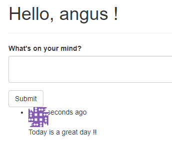

# 部落格文章

讓能夠閱讀與撰寫文章，重複使用模板，將清單分頁

# 送出與顯示部落格文章

在首頁顯示撰寫文章區域，可用列表方式看到其他文章

## 文章model

建立內文body、timestamp、和User model建立一對多關係的author_id

app/models.py

```python

# ...
class User(UserMixin, db.Model):
# ...
	posts = db.relationship('Post', backref='author', lazy='dynamic')
# ...

class Post(db.Model):
    __tablename__ = 'posts'
    id = db.Column(db.Integer, primary_key=True)
    body = db.Column(db.Text)
    timestamp = db.Column(db.DateTime, index=True, default=datetime.utcnow)
    author_id = db.Column(db.Integer, db.ForeignKey('users.id')) # 關聯用
```

更新db

```bash
flask db migrate -m "add post table"
flask db upgrade
```

## 表單

只包含一個文字區域輸入文章，和送出按鈕

app/main/forms.py

```python
# ...
class PostForm(FlaskForm):
    body = TextAreaField("What's on your mind?", validators=[DataRequired()])
    submit = SubmitField('Submit')
```

## 部落格首頁文章路由

修改原有index()

app/main/views.py

```python
from flask import render_template, redirect, url_for, abort, flash
from flask_login import login_required, current_user
from . import main
from .forms import EditProfileForm, EditProfileAdminForm, PostForm
from .. import db
from ..models import Permission, Role, User, Post
from ..decorators import admin_required

@main.route('/', methods=['GET', 'POST'])
def index():
    form = PostForm()
    # 送出後先檢查使用者寫入權限
    if current_user.can(Permission.WRITE) and form.validate_on_submit():
        post = Post(body=form.body.data,
                    author=current_user._get_current_object()) # 傳入當前使用者的物件到author變數
        db.session.add(post)
        db.session.commit()
        return redirect(url_for('.index'))
    posts = Post.query.order_by(Post.timestamp.desc()).all() # 將所有文章按照時間排序
    return render_template('index.html', form=form, posts=posts)

# ...
```

author=current_user._get_current_object()

current_user 是本地執行序代理物件所寫成的(is implemented as a thread-local proxy object)，這是一層包裝，裡面有實際的使用者物件。但是資料庫儲存時需要真正的使用者物件，因此使用get_current_object( ) 將其取出

## 擴充首頁模板 包含部落格文章

app/templates/index.html

```html



Flasky


<div class="page-header">
    <h1>Hello, 
                {{ current_user.username }}
                Stranger
                !</h1>
</div>
<div>
<!--  有寫入權限才會顯示文章輸入框  -->
    
    {{ wtf.quick_form(form) }}
    
</div>
<ul class="posts">
    
    <li class="post">
<!--    在左側增加作者頭像    -->
        <div class="post-thumbnail">
            <a href="{{ url_for('.user', username=post.author.username) }}">
                
            </a>
        </div>
        <div class="post-content">
            <div class="post-date">{{ moment(post.timestamp).fromNow() }}</div>
            <div class="post-author"><a href="{{ url_for('.user', username=post.author.username) }}">{{ post.author.username }}</a></div>
            <div class="post-body">{{ post.body }}</div>
        </div>
    </li>
    
</ul>

```

修改CSS 美化排版

app/static/styles.css

```css
.profile-thumbnail {
    position: absolute;
}
.profile-header {
    min-height: 260px;
    margin-left: 280px;
}

ul.posts {
    list-style-type: none;
    padding: 0px;
    margin: 16px 0px 0px 0px;
    border-top: 1px solid #e0e0e0;
}
ul.posts li.post {
    padding: 8px;
    border-bottom: 1px solid #e0e0e0;
}
ul.posts li.post:hover {
    background-color: #f0f0f0;
}
div.post-date {
    float: right;
}
div.post-author {
    font-weight: bold;
}
div.post-thumbnail {
    position: absolute;
}
div.post-content {
    margin-left: 48px;
    min-height: 48px;
}
```

修改CSS 前



修改後


# 個人資訊頁的文章

在個人資訊頁顯示由該使用者撰寫的文章清單

## 修改路由傳入 posts

app/main/views.py

```python
# 個人資訊頁
@main.route('/user/<username>')
def user(username):
    user = User.query.filter_by(username=username).first_or_404()  # 若找不到user就跳404
    posts = user.posts.order_by(Post.timestamp.desc()).all()
    return render_template('user.html', user=user, posts=posts)  # 將user傳入模板 顯示訊息
```

因為文章列表示用user.posts的關係拿到的，用法就像一般的query object 所以可以使用order_by () 等filter 方法

## 重複利用模板顯示文章列表

由於index.html 和 user.thml 同樣都要顯示文章列表，所以將共同部份抽出另外設置一個新的模板_posts.html，前面補上底線是用來區分完整模板與部分模板(共同使用的)

app/templates/_posts.html

```html
<ul class="posts">
    
    <li class="post">
        <div class="post-thumbnail">
            <a href="{{ url_for('.user', username=post.author.username) }}">
                
            </a>
        </div>
        <div class="post-content">
            <div class="post-date">{{ moment(post.timestamp).fromNow() }}</div>
            <div class="post-author"><a href="{{ url_for('.user', username=post.author.username) }}">{{ post.author.username }}</a></div>
            <div class="post-body">{{ post.body }}</div>
        </div>
    </li>
    
</ul>
```

在要使用這個部分模板的主模板，透過 Jinja2 的include來匯入

首頁模板

app/templates/index.html

```html



Flasky


<div class="page-header">
    <h1>Hello, 
                {{ current_user.username }}
                Stranger
                !</h1>
</div>
<div>
<!--  有寫入權限才會顯示文章輸入框  -->
    
    {{ wtf.quick_form(form) }}
    
</div>
<!-- 匯入_posts的共通模板 -->


```

個人資訊頁模板

app/templates/user.html

```html


Flasky - {{ user.username }}


<div class="page-header">
<!--    增加圖片連結 與 CSS用的class 名稱 profile-thumbnail 和 profile-header-->
    
    <div class="profile-header">
        <h1>{{ user.username }}</h1>
        
        <p>
            
                {{ user.name }}
            
            
            <!--  會出現以user.location為中心的地圖      -->
                from <a href="http://maps.google.com/?q={{ user.location }}">{{ user.location }}</a>
            
        </p>
        
        
        <!-- 如果是管理員登入，就把使用者的email地址轉成mailto連結顯示   -->
        <p><a href="mailto:{{ user.email }}">{{ user.email }}</a></p>
        
        <p>{{ user.about_me }}</p>
        <!-- 顯示時間-->
        <p>Member since {{ moment(user.member_since).format('L') }}. Last seen {{ moment(user.last_seen).fromNow() }}.</p>

        <p>
        <!--    當使用者登入時 只會顯示自己的連結    -->
            
            <a class="btn btn-default" href="{{ url_for('.edit_profile') }}">Edit Profile</a>
            
        <!--    管理員編輯連結    -->
            
            <a class="btn btn-danger" href="{{ url_for('.edit_profile_admin', id=user.id) }}">Edit Profile [Admin]</a>
            
        </p>
    </div>
</div>
<!--匯入部分模板 顯示個人文章列表 -->
<h3>Posts by {{ user.username }}</h3>


```

# 建立假的部落格文章資料

## 安裝faker

Faker 是可以自動化產生偽造資料的套件，用來將測試資料加入資料庫

[官方文件](https://pypi.org/project/Faker/)

[其他教學文章](https://www.mdeditor.tw/pl/2o7J/zh-tw)

```html
pip install faker
```

(這是開發時才會使用的套件，為了區分開發和產品階段，可以將requirements從檔案改成建立資料夾，再由資料夾中區分不同階段的依賴套件項目，區分成common.txt , dev.txt, prod.txt )

也可以產生不同語言的文字

```bash
from faker import Faker
fake = Faker(['it_IT', 'en_US', 'ja_JP'])
for _ in range(10):
    print(fake.name())

# 鈴木 陽一
# Leslie Moreno
# Emma Williams
# 渡辺 裕美子
# Marcantonio Galuppi
# Martha Davis
# Kristen Turner
# 中津川 春香
# Ashley Castillo
# 山田 桃子
```

## 建立偽造使用者與文章

app/fake.py

```python
from random import randint
from sqlalchemy.exc import IntegrityError
from faker import Faker
from . import db
from .models import User, Post

def users(count=100):  # 透過Faker建立一百名使用者的假資料
    fake = Faker()
    i = 0
    while i < count:
        user = User(email=fake.email(),
                 username=fake.user_name(),
                 password='password',
                 confirmed=True,
                 name=fake.name(),
                 location=fake.city(),
                 about_me=fake.text(),
                 member_since=fake.past_date())
        db.session.add(user)
        try:
            # 因為email 和username 是隨機產生
            db.session.commit()
            i += 1
        except IntegrityError:  # 若發生重複會報錯誤
            db.session.rollback() # 回復session 取消重複的使用者

def posts(count=100):  # 創建假文章
    fake = Faker()
    user_count = User.query.count()
    for i in range(count):
        # 用offset掉隨機整數 取得user 再指派給文章 建立關聯
        user = User.query.offset(randint(0, user_count - 1)).first()
        post = Post(body=fake.text(),
                 timestamp=fake.past_date(),
                 author=user)
        db.session.add(post)
    db.session.commit()
```

用shell 就可以建造大量的使用者與文章

```bash
flask shell
>>> from app import fake
>>> fake.users(100)
>>> fake.posts(100)
```


# 建立文章分頁

## 修改首頁路由，將文章清單分頁

app/main/views.py

```python
from flask import render_template, redirect, url_for, abort, flash, request, current_app
from flask_login import login_required, current_user
from . import main
from .forms import EditProfileForm, EditProfileAdminForm, PostForm
from .. import db
from ..models import Permission, Role, User, Post
from ..decorators import admin_required

@main.route('/', methods=['GET', 'POST'])
def index():
    form = PostForm()
    # 送出後先檢查使用者寫入權限
    if current_user.can(Permission.WRITE) and form.validate_on_submit():
        post = Post(body=form.body.data,
                    author=current_user._get_current_object())  # 傳入當前使用者的物件到author變數
        db.session.add(post)
        db.session.commit()
        return redirect(url_for('.index'))
    page = request.args.get('page', 1, type=int) # 從request的查詢字串取得，預設是第一頁
    # 先將所有文章按照時間排序 設定分頁選項
    pagination = Post.query.order_by(Post.timestamp.desc()).paginate(
        page, per_page=current_app.config['FLASKY_POSTS_PER_PAGE'],
        error_out=False)
    posts = pagination.items
    return render_template('index.html', form=form, posts=posts, pagination=pagination)

# ...
```

先從request.args 取的頁數資料，如果沒有就使用預設的第一頁，type=int 確保如果引數沒辦法轉成int 就回傳預設值

把原本Post.query的結尾從all( ) 改為 paginate ( ) ，第一個且唯一必須的引數是頁數

per_page是指定每一頁有多少項目

error_out 預設為True ，超出有效範圍的網頁時回傳404錯誤

error_out 設為 False，超出範圍會回傳空的List

在config.py 添加分頁數量的常數

```python
import os
basedir = os.path.abspath(os.path.dirname(__file__))

class Config:
# ...
FLASKY_POSTS_PER_PAGE = 20

# ...
```

## 加入分頁widget

paginate( ) 回傳的是Flask-SQLAlchemy定義的 Pagination類別的物件。物件有可以協助在模板中生成網頁連結的屬性(Attribute)

[Flask-SQLAlchemy 分頁物件屬性](https://www.notion.so/d7328be69d4048ce936c7ffdeb76c3b0)

[Flask-SQLAlchemy 分頁物件方法](https://www.notion.so/558e1b14085c4e25a7185afa90c68d03)

使用Flask-SQLAlchemy 分頁物件和Bootstrap的分頁CSS類別就能在模板中建立分頁頁腳(footer)

### 分頁模板巨集

查詢巨集用法?

app/templates/_macros.html

```python

<ul class="pagination">
    <li class="disabled">
        <a href="{{ url_for(endpoint, page=pagination.prev_num, **kwargs) }}#">
            &laquo;
        </a>
    </li>
    
        <!--  iter_page() 回傳所有網頁的連結  -->
        
        <!--    再被轉成有明確頁數的連結  當成url_for()的引數     -->
            
            <li class="active">
                <a href="{{ url_for(endpoint, page = p, **kwargs) }}">{{ p }}</a>
            </li>
            
            <li>
                <a href="{{ url_for(endpoint, page = p, **kwargs) }}">{{ p }}</a>
            </li>
            
        

        <li class="disabled"><a href="#">&hellip;</a></li>
        
    
    <!--   如果是最後一頁連結會被停用 -->
    <li class="disabled">
        <a href="
                    {{ url_for(endpoint, page=pagination.next_num, **kwargs) }}
                 
                    #
                 ">
            &raquo;
        </a>
    </li>
</ul>

```

Jinja2 巨集( Jinja2 macros )會接收關鍵字引數不用在引數list中加上**kwargs，這個分頁巨集會把他收到的關鍵字引數都傳給產生分頁連結的url_for( )，此類做法可以用在個人資訊頁面這類型的動態路由上。

### 文章清單頁腳

在index.html 和 user.html 使用的_posts.html模板下方加入pagination_widget巨集，顯示分頁功能

app/templates/index.html

```python




Flasky


<div class="page-header">
    <h1>Hello, 
                {{ current_user.username }}
                Stranger
                !</h1>
</div>
<div>
<!--  有寫入權限才會顯示文章輸入框  -->
    
    {{ wtf.quick_form(form) }}
    
</div>
<!-- 匯入_posts的共通模板 -->


<!--匯入分頁巨集-->

<div class="pagination">
    {{ macros.pagination_widget(pagination, '.index') }}
</div>


```

app/templates/user.html

```python



Flasky - {{ user.username }}


<div class="page-header">
<!--    增加圖片連結 與 CSS用的class 名稱 profile-thumbnail 和 profile-header-->
    
    <div class="profile-header">
        <h1>{{ user.username }}</h1>
        
        <p>
            
                {{ user.name }}
            
            
            <!--  會出現以user.location為中心的地圖      -->
                from <a href="http://maps.google.com/?q={{ user.location }}">{{ user.location }}</a>
            
        </p>
        
        
        <!-- 如果是管理員登入，就把使用者的email地址轉成mailto連結顯示   -->
        <p><a href="mailto:{{ user.email }}">{{ user.email }}</a></p>
        
        <p>{{ user.about_me }}</p>
        <!-- 顯示時間-->
        <p>Member since {{ moment(user.member_since).format('L') }}. Last seen {{ moment(user.last_seen).fromNow() }}.</p>

        <p>
        <!--    當使用者登入時 只會顯示自己的連結    -->
            
            <a class="btn btn-default" href="{{ url_for('.edit_profile') }}">Edit Profile</a>
            
        <!--    管理員編輯連結    -->
            
            <a class="btn btn-danger" href="{{ url_for('.edit_profile_admin', id=user.id) }}">Edit Profile [Admin]</a>
            
        </p>
    </div>
</div>
<!--匯入部分模板 顯示個人文章列表 -->
<h3>Posts by {{ user.username }}</h3>

<!--匯入分頁巨集-->

<div class="pagination">
    {{ macros.pagination_widget(pagination, '.index') }}
</div>


```

增加分頁style

app/static/styles.css

```css
# ...
div.pagination {
    width: 100%;
    text-align: right;
    padding: 0px;
    margin: 0px;
}
```


# 建立Markdown 與 Flask-PageDown 編輯器

改善輸入文章的的文字區域，支援Markdown語法與即時預覽

## 安裝套件

PageDown: 用JS寫成的Markdown到HTML轉換器

Flask-PageDown: 讓falsk使用的PageDown包裝器，整合PageDown和Flask-WTF表單

Markdown: 用Python實作的伺服器端Markdown至HTML轉換器

Bleach: 用python實作的HTML 消毒器(sanitizer) ，移除HTML標籤

```bash
pip install flask-pagedown markdown bleach
```

## 初始化Flask-PageDown

### 加入到app中

app/__init__.py

```python
from flask import Flask
from flask_bootstrap import Bootstrap
from flask_mail import Mail
from flask_moment import Moment
from flask_sqlalchemy import SQLAlchemy
from config import config
from flask_login import LoginManager
from flask_pagedown import PageDown

bootstrap = Bootstrap()
mail = Mail()
moment = Moment()
db = SQLAlchemy()
pagedown = PageDown()

# 初始化 flask login
login_manager = LoginManager()
login_manager.login_view = 'auth.login'

def create_app(config_name):
    app = Flask(__name__)
    app.config.from_object(config[config_name])
    config[config_name].init_app(app)

    bootstrap.init_app(app)
    mail.init_app(app)
    moment.init_app(app)
    db.init_app(app)
    login_manager.init_app(app)
    pagedown.init_app(app)
    
    from .main import main as main_blueprint
    app.register_blueprint(main_blueprint)

    from .auth import auth as auth_blueprint
    app.register_blueprint(auth_blueprint, url_prefix='/auth')  # 補上url前置路徑

    return app
```

### 啟用Markdown的文章表單

修改PostForm的body欄位，從原本的TextAreaField改成PageDownField

```python
from flask_pagedown.fields import PageDownField
# ...
class PostForm(FlaskForm):
    body = PageDownField("What's on your mind?", validators=[DataRequired()])
    submit = SubmitField('Submit')
```

### 宣告Flask-PageDown模板

Markdown預覽適用PageDown的程式庫所產生的，因此要將其加入模板，flask-pagedown提供一個模版巨集完成這項工作，包含所需要的CDN檔案

app/templates/index.html

```html
# ...

{{ super() }}
{{ pagedown.include_pagedown() }}

```

畫面效果


# 在伺服器處理markdown文字

在送出表單時只用post 送出原始的markdown文字，如果允許預覽的HTML傳入到server的話很容易受到XSS攻擊。

因此只用markdown傳送來源文字，到伺服器後再用Markdown (python 的轉換器) 轉成HTML，在用Bleach 套件消毒產生的HTML，確保文章裡面只有少數可允許的HTML標籤

若在_posts.html中將markdown文章轉換成HTML會是沒有效率的做法，這當文章要轉譯成網頁是就要先轉換。

因此在文章被建立時就直接轉換，把轉譯後的HTML存到Post model的新欄位中保存，讓模板可以直接讀取，並將原始的Markdown來源文章存入資料庫，方便使用者編輯時使用。

## 在Post model中處理markdown文字

app/models.py

```python
from werkzeug.security import generate_password_hash, check_password_hash
from flask_login import UserMixin, AnonymousUserMixin
from . import db, login_manager
from itsdangerous import TimedJSONWebSignatureSerializer as Serializer
from flask import current_app, request
from datetime import datetime
import hashlib
from markdown import markdown
import bleach

# ...

class Post(db.Model):
    __tablename__ = 'posts'
    id = db.Column(db.Integer, primary_key=True)
    body = db.Column(db.Text) # 儲存markdown 格式文章
    body_html = db.Column(db.Text)  # 儲存html 格式文章
    timestamp = db.Column(db.DateTime, index=True, default=datetime.utcnow)
    author_id = db.Column(db.Integer, db.ForeignKey('users.id'))

    @staticmethod
    def on_changed_body(target, value, oldvalue, initiator):  # 轉譯內文的html後保存
        allowed_tags = ['a', 'abbr', 'acronym', 'b', 'blockquote', 'code',
                        'em', 'i', 'li', 'ol', 'pre', 'strong', 'ul',
                        'h1', 'h2', 'h3', 'p']
# 先轉換成HTML 再做標籤清理
        target.body_html = bleach.linkify(bleach.clean(
            markdown(value, output_format='html'), 
            tags=allowed_tags, strip=True))
# 設置監聽 當body被設為新值時自動呼叫
db.event.listen(Post.body, 'set', Post.on_changed_body)
```

首先markdown( ) 函式會先將內文轉換成HTML

將結果與白名單的標籤送到bleach.clean( )，其他的標籤則被移除

最後bleach.linkify( )，會把文字寫成的URL 轉成有<a> 標籤的連結

↑用戶端是用PageDown來支援此功能，server端則是用bleach.linkify

## 讓_posts.html 模版中使用HTML版本的內文

app/templates/_posts.html

```html
<ul class="posts">
    
    <li class="post">
        <div class="post-thumbnail">
            <a href="{{ url_for('.user', username=post.author.username) }}">
                
            </a>
        </div>
        <div class="post-content">
            <div class="post-date">{{ moment(post.timestamp).fromNow() }}</div>
            <div class="post-author"><a href="{{ url_for('.user', username=post.author.username) }}">{{ post.author.username }}</a></div>
                    <div class="post-body">
                
								<!--    關閉html escape      -->
                    {{ post.body_html | safe }}
                
                    {{ post.body }}
                
        </div>
    </li>
    
</ul>
```

為了安全起見，Jinja2會 escape HTML元素，但這邊的HTML是由server從Markdown產生並清理過的，所以可以直接轉譯成HTML顯示

第一條是HTML 版本 第二條是原本的字串


# 部落格文章連結

為了傳送部落格的文章連結，每篇文章都要能被指派到一個網頁，和不重複的URL

## 增加文章路由

此處用文章的id值做辨認

app/main/view.py

```python
@main.route('/post/<int:id>')
def post(id):
    post = Post.query.get_or_404(id)
    return render_template('post.html', posts=[post])
```

若要用更容易理解的URL，可以指派一個slug給每一篇文章，可用文章的標題或前面幾個字構成不重複的字串

## 修改_post模板，增加永久連結模板

app/templates/_post.html

```html
<ul class="posts">
    
    <li class="post">
        <div class="post-thumbnail">
            <a href="{{ url_for('.user', username=post.author.username) }}">
                
            </a>
        </div>
        <div class="post-content">
            <div class="post-date">{{ moment(post.timestamp).fromNow() }}</div>
            <div class="post-author"><a href="{{ url_for('.user', username=post.author.username) }}">{{ post.author.username }}</a></div>
                    <div class="post-body">
                
                <!--    關閉html escape      -->
                    {{ post.body_html | safe }}
                
                    {{ post.body }}
                
        </div>
       <!--      將連結加在文章的下方      -->
        <div class="post-footer">
            <a href="{{ url_for('.post', id=post.id) }}">
                <span class="label label-default">Permalink</span>
            </a>
        </div>
    </li>
    
</ul>
```

建立永久連結模板

app/templates/post.html

```html



Flasky - Post




```


# 文章編輯頁面

文章編輯器在單獨的網頁中，由Flask-PageDown寫成的，裡面有文字區域可讓使用者編輯Markdown文字，以及轉譯後的預覽結果

## 文章編輯模板

app/templates/edit_post.html

```html



Flasky - Edit Post


<div class="page-header">
    <h1>Edit Post</h1>
</div>
<div>
    {{ wtf.quick_form(form) }}
</div>



{{ super() }}
{{ pagedown.include_pagedown() }}

```

## 文章編輯路由

app/main/views.py

```python
# ...

@main.route('/edit/<int:id>', methods=['GET', 'POST'])
@login_required
def edit(id):
    post = Post.query.get_or_404(id)
    # 只允許作者與管理員編輯 否則回傳403
    if current_user != post.author and not current_user.can(Permission.ADMIN):
        abort(403)
    form = PostForm()  # 表單class與首頁使用的相同
    if form.validate_on_submit():
        post.body = form.body.data
        db.session.add(post)
        db.session.commit()
        flash('The post has been updated.')
        return redirect(url_for('.post', id=post.id))
    form.body.data = post.body
    return render_template('edit_post.html', form=form)
```

## 增加文章編輯連結

在每一篇文章的下方永久連結旁，加上文章編輯的連結 Edit

並使用不同的樣式，凸顯管理員編輯功能

app/templates/_posts.html

```python
<ul class="posts">
    
    <li class="post">
        <div class="post-thumbnail">
            <a href="{{ url_for('.user', username=post.author.username) }}">
                
            </a>
        </div>
        <div class="post-content">
            <div class="post-date">{{ moment(post.timestamp).fromNow() }}</div>
            <div class="post-author"><a href="{{ url_for('.user', username=post.author.username) }}">{{ post.author.username }}</a></div>
                    <div class="post-body">
                
                <!--    關閉html escape      -->
                    {{ post.body_html | safe }}
                
                    {{ post.body }}
                
        </div>
       <!--      將連結加在文章的下方      -->
            <div class="post-footer">
                
                <a href="{{ url_for('.edit', id=post.id) }}">
                    <span class="label label-primary">Edit</span>
                </a>
                
                <a href="{{ url_for('.edit', id=post.id) }}">
                    <span class="label label-danger">Edit [Admin]</span>
                </a>
                
                <a href="{{ url_for('.post', id=post.id) }}">
                    <span class="label label-default">Permalink</span>
                </a>
            </div>
    </li>
    
</ul>
```

本身是作者 顯示藍色Edit按鈕

若是管理員看到其他人的文章會是紅色Edit [Admin]


點選進入後的文章編輯頁面

