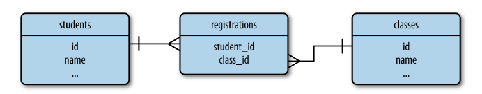

# 追隨者

社群觀念的web app可以讓使用者與其他使用者建立連結，而app會追蹤一對使用者的有向連結(directional links)，並在查詢時使用這些連結。

實作項目

讓使用者可以追隨 (follow ) 其他追隨者

讓使用者可以在首頁只列出他們追隨使用者所寫的文章

# 資料庫關係

此小節為範例說明，與本身網站內容無關

## 多對多關係



多對多關係中，多建立中間的關聯表，將其區分成兩個一對多關係。

[一對多範例連結](https://www.notion.so/b8ee9a42b79540a2a21a452d63373adb)

```python
# 關聯表各自設定外聯鍵
registrations = db.Table('registrations',
		db.Column('student_id', db.Integer, db.ForeignKey('students.id')), 
		db.Column('class_id', db.Integer, db.ForeignKey('classes.id'))
)

class Student(db.Model):
		id = db.Column(db.Integer, primary_key=True)
		name = db.Column(db.String)
		# 將另一側多方設為變數名稱 且多對多關係中要將secondary設為關聯表
		classes = db.relationship('Class',secondary=registrations, 
																			backref=db.backref('students', lazy='dynamic'), # 反向的關係
																			lazy='dynamic')

class Class(db.Model):
		id = db.Column(db.Integer, primary_key=True)
		name = db.Column(db.String)
```

在多對多關係中要將其中一個class 中定義關係。在此處將關聯表定義成簡單的資料表而不是model class ，因為SQLAlchemy會在內部管理這張表。

正向關係: 以學生為主的話，學生有多門課，因此將classes設為變數，對此作關聯，寫入另一側多方class 名稱，並將secondary設為關聯表

反向關係: 以課程來說的話，有多位學生選修這門課，因此反向關係要設為students

關聯表的外聯鍵 db.ForeignKey ( ) 要設為正反關係中為對方所設置的變數

classes關係使用list semantic (串列語法)

假設有位學生s 和一門課程 c 

1.  要幫學生註冊課程的方式為

```bash
s.classes.append(c)
db.session.add(s)
```

2. 要列出學生s的所有課程為

```bash
s.classes.all()
```

3. 要列出c課程的所有學生名單為

```bash
c.students.all()
```

Class model 的students的關係是在db.backref( ) 引述定義的。關係中backref引數也有一個 lazy='dynamic'屬性，所以兩邊都會回傳一個使用過濾器的查詢指令

4. 學生退選c 課程為

```bash
s.classes.remove(c)
```

## 自我參考關係 (Self-Referential Relationships)


在使用者追隨其他使用者時，都是同一張table，這種情況稱為自我參考 ( self-referential )，關聯表中的追隨者與被追隨者都是user

# 製作追隨關聯表

在處理多對多關係時，通常要儲存關於連結的其他資料。就追隨者關係而言需要儲存開始追隨另一位使用者的時間，這樣才能依照時間排序追隨者名單。前面範例學生與課程的作法關聯表是完全受到SQLAlchemy管理的內部資料表。

## 建立基本操作

為了使用自訂資料要改善關聯表，讓它成為可讓app存取的模型，因為SQLAlchemy 沒辦法透明的使用關聯表，因為沒辦法存取裡面的自訂欄位，所以要將多對多關係分解成左右兩側的一對多關係，並且定義成標準關係(these must be defined as standard relationships.)

app/models.py

```python
# ...
class Follow(db.Model): # 追隨關聯表
    __tablename__ = 'follows'
    follower_id = db.Column(db.Integer, db.ForeignKey('users.id'), primary_key=True) # 追隨方
    followed_id = db.Column(db.Integer, db.ForeignKey('users.id'), primary_key=True) # 被追隨方
    timestamp = db.Column(db.DateTime, default=datetime.utcnow)

class User(UserMixin, db.Model): # 建立兩個一對多關係
# ....

followed = db.relationship('Follow', foreign_keys=[Follow.follower_id],
                                     backref=db.backref('follower', lazy='joined'), #　反向參考的載入方式
                                     lazy='dynamic',　# 自己的載入方式
                                     cascade='all, delete-orphan')

followers = db.relationship('Follow', foreign_keys=[Follow.followed_id],
                                      backref=db.backref('followed', lazy='joined'),
                                      lazy='dynamic',
                                      cascade='all, delete-orphan')

# ....
```

[關係選項](https://www.notion.so/1ccbacb6fbdf47f99e1bb4bee276a18b)

User model將followed 和 followers都定義為單獨的一對多關係，在foreign_keys上需要明確定義外連鍵。這邊的db.backref( ) 不會互相影響，反向參考則是會被應用在Follow model上。

- 反向參考的lazy設定
    - 將反向參考的lazy='joined' ，這種模式會讓相關的物件立即使用 join 指令。

        例如: 有名使用者追隨一百位使用者，呼叫user.followed.all( ) 會得到一個有100個Follow實例的清單，每一個實例都有設相對應使用者的follower和followed反向參考特性 

    - 若將lazy設為預設值的select，那follower和followed使用者被第一次讀取時會惰性載入 ( loaded lazily )，而且每個屬性要時使用時都需要個別的查詢指令。因此為了拿到完整的被追隨者名單，需要100個額外的查詢指令 。

這樣的設定表示是在"一側" 回傳 "多側"

- 自己的lazy設定

    使用dynamic 表示會回傳查詢指令物件( query object )，而不是項目 ( items ) ，這樣才能使用其他的filter 過濾器指令查詢

cascade引數是設置對父物件執行的動作如何傳遞到相關物件

其中一種使用案例是 當物件被加入到資料庫session時，透過relationship 和它建立關聯的物件也要自動加入session。

但當一個物件被刪除時，預設的行為是把與它建立連結的任何物件的外鍵都設為null。

但在關聯表正確的行為是將指向已被刪除的紀錄項目也刪除，才能有效地銷毀連結。這就是delete-orphan 刪除孤兒的用途。

指派給cascade的值是以逗號分隔的選項。all 代表 delete-orphan 以外的選項
cascade='all, delete-orphan' 表示 啟用預設的cascade選項但要加入刪除孤兒紀錄的行為

## 建立追隨者協助方法

因為現在要用兩個一對多關係實現多對多功能，所以在User model中幫所有可能執行的操作建立 helper 方法

app/models.py

```python
# ...
	
class User(UserMixin, db.Model):
# ...
		def follow(self, user): # 加入追隨者
        if not self.is_following(user):  # 檢查如果不是現有追隨者的話就加入
            f = Follow(followed=user)
            self.followed.append(f)

    def unfollow(self, user): # 解除追隨關係
        f = self.followed.filter_by(followed_id=user.id).first()
        if f:
            self.followed.remove(f)

    # 檢查一對多關係 若有就回傳
    def is_following(self, user):
        if user.id is None:  # 檢查user.id 是否存在
            return False
        return self.followed.filter_by(
            followed_id=user.id).first() is not None

    def is_followed_by(self, user):
        if user.id is None:
            return False
        return self.followers.filter_by(
            follower_id=user.id).first() is not None

# ....
```

timestamp  已經被寫好預設是系統時間 因此不需要再此處給予值

## 單元測試

tests/test_user_model.py

```python
import unittest
import time
from app import create_app, db
from app.models import User, AnonymousUser, Role, Permission, Follow

class UserModelTestCase(unittest.TestCase):

	def test_follows(self):
	        u1 = User(email='john@example.com', password='cat')
	        u2 = User(email='susan@example.org', password='dog')
	        db.session.add(u1)
	        db.session.add(u2)
	        db.session.commit()
	        self.assertFalse(u1.is_following(u2))
	        self.assertFalse(u1.is_followed_by(u2))
	        timestamp_before = datetime.utcnow()
	        u1.follow(u2)
	        db.session.add(u1)
	        db.session.commit()
	        timestamp_after = datetime.utcnow()
	        self.assertTrue(u1.is_following(u2))
	        self.assertFalse(u1.is_followed_by(u2))
	        self.assertTrue(u2.is_followed_by(u1))
	        self.assertTrue(u1.followed.count() == 1)
	        self.assertTrue(u2.followers.count() == 1)
	        f = u1.followed.all()[-1]
	        self.assertTrue(f.followed == u2)
	        self.assertTrue(timestamp_before <= f.timestamp <= timestamp_after)
	        f = u2.followers.all()[-1]
	        self.assertTrue(f.follower == u1)
	        u1.unfollow(u2)
	        db.session.add(u1)
	        db.session.commit()
	        self.assertTrue(u1.followed.count() == 0)
	        self.assertTrue(u2.followers.count() == 0)
	        self.assertTrue(Follow.query.count() == 0)
	        u2.follow(u1)
	        db.session.add(u1)
	        db.session.add(u2)
	        db.session.commit()
	        db.session.delete(u2)
	        db.session.commit()
	        self.assertTrue(Follow.query.count() == 0)
```

# 個人資料列上的追隨者

要讓使用者可以在別人的個人資訊頁上顯示Follow或是Unfollow，另外也要顯示追隨者與被追隨者的人數、顯示追雖者

## 個人資訊頁模板

app/templates/user.html

```html


Flasky - {{ user.username }}


<div class="page-header">
<!--    增加圖片連結 與 CSS用的class 名稱 profile-thumbnail 和 profile-header-->
    
    <div class="profile-header">
        <h1>{{ user.username }}</h1>
        
        <p>
            
                {{ user.name }}
            
            
            <!--  會出現以user.location為中心的地圖      -->
                from <a href="http://maps.google.com/?q={{ user.location }}">{{ user.location }}</a>
            
        </p>
        
        
        <!-- 如果是管理員登入，就把使用者的email地址轉成mailto連結顯示   -->
        <p><a href="mailto:{{ user.email }}">{{ user.email }}</a></p>
        
        <p>{{ user.about_me }}</p>
        <!-- 顯示時間-->
        <p>Member since {{ moment(user.member_since).format('L') }}. Last seen {{ moment(user.last_seen).fromNow() }}.</p>

        <p>{{ user.posts.count() }} blog posts.</p>
        <!--    顯示追隨者相關資訊    -->
        <p>
            
                
                <a href="{{ url_for('.follow', username=user.username) }}" class="btn btn-primary">Follow</a>
                
                <a href="{{ url_for('.unfollow', username=user.username) }}" class="btn btn-default">Unfollow</a>
                
            
            <a href="{{ url_for('.followers', username=user.username) }}">Followers: <span class="badge">{{ user.followers.count() }}</span></a>
            <a href="{{ url_for('.followed_by', username=user.username) }}">Following: <span class="badge">{{ user.followed.count() }}</span></a>
            
            | <span class="label label-default">Follows you</span>
            
        </p>
        <p>
        <!--    當使用者登入時 只會顯示自己的連結    -->
            
            <a class="btn btn-default" href="{{ url_for('.edit_profile') }}">Edit Profile</a>
            
        <!--    管理員編輯連結    -->
            
            <a class="btn btn-danger" href="{{ url_for('.edit_profile_admin', id=user.id) }}">Edit Profile [Admin]</a>
            
        </p>
    </div>
</div>
<!--匯入部分模板 顯示個人文章列表 -->
<h3>Posts by {{ user.username }}</h3>


<!--匯入分頁巨集-->

<div class="pagination">
    {{ macros.pagination_widget(pagination, '.index') }}
</div>


```

新增四個endpoint 要在路由中添加

app/main/views.py

```python
from flask import render_template, redirect, url_for, abort, flash, request, current_app
from flask_login import login_required, current_user
from . import main
from .forms import EditProfileForm, EditProfileAdminForm, PostForm
from .. import db
from ..models import Permission, Role, User, Post
from ..decorators import admin_required, permission_required

# ...

# 建立追隨關係
@main.route('/follow/<username>')
@login_required
@permission_required(Permission.FOLLOW)
def follow(username):
    user = User.query.filter_by(username=username).first()
    if user is None:
        flash('Invalid user.')
        return redirect(url_for('.index'))
    if current_user.is_following(user):
        flash('You are already following this user.')
        return redirect(url_for('.user', username=username))
    current_user.follow(user)
    db.session.commit()
    flash('You are now following %s.' % username)
    return redirect(url_for('.user', username=username))

# 解除追隨關係
@main.route('/unfollow/<username>')
@login_required
@permission_required(Permission.FOLLOW)
def unfollow(username):
    user = User.query.filter_by(username=username).first()
    if user is None:
        flash('Invalid user.')
        return redirect(url_for('.index'))
    if not current_user.is_following(user):
        flash('You are not following this user.')
        return redirect(url_for('.user', username=username))
    current_user.unfollow(user)
    db.session.commit()
    flash('You are not following %s anymore.' % username)
    return redirect(url_for('.user', username=username))
```

follow( ) 會載入被請求的使用者，確認他是有效的，而且沒被使用者追隨過，接著呼叫User model的follow( ) 建立連結，unfollow 的也是類似判斷

```python
# 提供查詢追隨自己的
@main.route('/followers/<username>')
def followers(username):
    user = User.query.filter_by(username=username).first()
    if user is None:
        flash('Invalid user.')
        return redirect(url_for('.index'))
    page = request.args.get('page', 1, type=int)
#從找出追隨自己的Follow實例 
    pagination = user.followers.paginate(
        page, per_page=current_app.config['FLASKY_FOLLOWERS_PER_PAGE'],
        error_out=False)
#整理出列表 傳入模板
    follows = [{'user': item.follower, 'timestamp': item.timestamp}
               for item in pagination.items]
    return render_template('followers.html', user=user, title="Followers of",
                           endpoint='.followers', pagination=pagination,
                           follows=follows)

# 查詢自己追隨的
@main.route('/followed_by/<username>')
def followed_by(username):
    user = User.query.filter_by(username=username).first()
    if user is None:
        flash('Invalid user.')
        return redirect(url_for('.index'))
    page = request.args.get('page', 1, type=int)
# 找出自己追隨的Follow實例
    pagination = user.followed.paginate(
        page, per_page=current_app.config['FLASKY_FOLLOWERS_PER_PAGE'],
        error_out=False)
    follows = [{'user': item.followed, 'timestamp': item.timestamp}
               for item in pagination.items]
    return render_template('followers.html', user=user, title="Followed by",
                           endpoint='.followed_by', pagination=pagination,
                           follows=follows)
```

## 在config中設定追隨顯示常數

config.py

```python
FLASKY_FOLLOWERS_PER_PAGE = 20
```

## 模板

app/templates/followers.html

```python



Flasky - {{ title }} {{ user.username }}


<div class="page-header">
    <h1>{{ title }} {{ user.username }}</h1>
</div>
<table class="table table-hover followers">
    <thead><tr><th>User</th><th>Since</th></tr></thead>
    
    <tr>
        <td>
            <a href="{{ url_for('.user', username = follow.user.username) }}">
                
                {{ follow.user.username }}
            </a>
        </td>
        <td>{{ moment(follow.timestamp).format('L') }}</td>
    </tr>
    
</table>
<div class="pagination">
    {{ macros.pagination_widget(pagination, endpoint, username = user.username) }}
</div>

```


# 用Join查詢追隨文章

## 如何使用join

現有兩張表 users 與 posts 以及關聯表 follows table

**users table**
id  |  username
1            john
2           susan
3           david

**posts table**

id |  author_id  |  body
1       2                Blog post by susan
2       1                Blog post by john
3       3                Blog post by david
4       1                Second blog post by john

**follows table**

follower_id  |  followed_id
1                         3
2                         1
2                         3

若要查詢susan的追隨者所有的文章

透過join 形成一張臨時表用來查詢有關係的相關資料 ( * 表示用來join的欄位)

id  | author_id*  | body                                   |  follower_id  | followed_id*
2           1               Blog post by john                    2                       1
3           3               Blog post by david                  2                       3
4           1               Second blog post by john       2                       1

## Flask-SQLAlchemy 的查詢指令

之前的查詢都西閃用被查詢的model的query指令。但這邊因為指令需要回傳posts資料列，要先對follows表套用filter，改用較基本的查詢格式

- 先查詢篩選再join

```python
db.session.query(Post).select_from(Follow).filter_by(follower_id=self.id).join(Post, Follow.followed_id == Post.author_id)
```

db.session.query(Post) :  指明是一個會回傳Post物件的查詢指令

select_from(Follow) :  指出這個查詢指令從Follow model 開始處理

filter_by(follower_id=self.id) :  使用追隨者 (follower user) 來過濾follows表

join(Post, Follow.followed_id == Post.author_id) : 結合 filter_by 的結果與 Post 物件

- 先join 再篩選

用交換過濾器與join的順序簡化指令

simplified by swapping the order of the filter and the join

```python
Post.query.join(Follow, Follow.followed_id == Post.author_id).filter(Follow.follower_id == self.id)
```

先join讓查詢指令從Post.query開始處理，這樣只有 join( ) 和 filter( ) 兩個過濾器，且兩個指令是等效的( equivalent )

SQLAlchemy 會先收集所有的filters再以最有效率的方式產生查詢指令

 

這兩個指令的SQL幾乎一樣，可以用print(str(query))來確認

## 取得被追隨的文章

app/models.py

```python
# ...
class User(UserMixin, db.Model):
# ...
		@property
    def followed_posts(self):
        return Post.query.join(Follow, Follow.followed_id == Post.author_id).filter(Follow.follower_id == self.id)
```

將followed_posts 定義為property，就不需要 ( ) ，可以讓所有關係都有相同的語法

# 在首頁顯示追隨的文章

首頁提供選項讓使用者選擇觀看所有文章，或只限於追隨者的文章

## 設置路由

修改index 加入追隨者

app/main/views.py

```python
# ...

@main.route('/', methods=['GET', 'POST'])
def index():
    form = PostForm()
    # 送出後先檢查使用者寫入權限
    if current_user.can(Permission.WRITE) and form.validate_on_submit():
        post = Post(body=form.body.data,
                    author=current_user._get_current_object())  # 傳入當前使用者的物件到author變數
        db.session.add(post)
        db.session.commit()
        return redirect(url_for('.index'))
    page = request.args.get('page', 1, type=int) # 從request的查詢字串取得，預設是第一頁

    # 是否顯示追隨者
    show_followed = False
    if current_user.is_authenticated:
				# 將顯示所有或追隨對象的選擇放在cookie中
        show_followed = bool(request.cookies.get('show_followed', ''))
    if show_followed:
        query = current_user.followed_posts # 此次新增取得所有追隨者的方式
    else:
        query = Post.query # 原本取得所有資料的方式

    # 先將所有文章按照時間排序 設定分頁選項
    pagination = query.order_by(Post.timestamp.desc()).paginate(
        page, per_page=current_app.config['FLASKY_POSTS_PER_PAGE'],
        error_out=False)
    posts = pagination.items
    return render_template('index.html', form=form, posts=posts, pagination=pagination, show_followed=show_followed)
# ....
```

若cookies中的show_followed 不是空字串，就顯示該追隨對象的文章。將cookie存在request物件中，成為request.cookies字典，並將cookie的字串轉換成boolean作為後面要下何種query取得資料的判斷依據。最後將show_followed放入送入模板

新增路由 選擇所有或追隨者對向的文章 show_followed cookie

app/main/views.py

```python
from flask import render_template, redirect, url_for, abort, flash, request, current_app, make_response
from flask_login import login_required, current_user
from . import main
from .forms import EditProfileForm, EditProfileAdminForm, PostForm
from .. import db
from ..models import Permission, Role, User, Post
from ..decorators import admin_required, permission_required

# ...
@main.route('/all')
@login_required
def show_all():
    resp = make_response(redirect(url_for('.index'))) # 建立回應物件
    resp.set_cookie('show_followed', '', max_age=30*24*60*60) # cookie 過期時間為30天候
    return resp

@main.route('/followed')
@login_required
def show_followed():
    resp = make_response(redirect(url_for('.index'))) # 建立回應物件
				# set_cookie('cookie_name' , 'cookie_value', max_age='expired_time') 
    resp.set_cookie('show_followed', '1', max_age=30*24*60*60)
    return resp
```

cookie 只能在回應物件上設定，因此要使用make_response( ) 建立回應物件，而不是由Flask 處理

max_age() 的引數是設定cookie幾秒後會過期，若沒有設置此選項 cookie會在瀏覽器視窗關閉時過期。

## 修改首頁模板

加上兩個導覽標籤呼叫 /all 或 /followed

index.html

```html




Flasky


<div class="page-header">
    <h1>Hello, 
                {{ current_user.username }}
                Stranger
                !</h1>
</div>
<div>
<!--  有寫入權限才會顯示文章輸入框  -->
    
    {{ wtf.quick_form(form) }}
    
</div>

<!-- 添加標籤 顯示所有文章 或 只顯示追隨者文章 -->
<div class="post-tabs">
    <ul class="nav nav-tabs">
        <li class="active"><a href="{{ url_for('.show_all') }}">All</a></li>
        
        <li class="active"><a href="{{ url_for('.show_followed') }}">Followed</a></li>
        
    </ul>
    
</div>

<!-- 匯入_posts的共通模板 -->


<!--匯入分頁巨集-->

<div class="pagination">
    {{ macros.pagination_widget(pagination, '.index') }}
</div>




{{ super() }}
{{ pagedown.include_pagedown() }}

```

# 讓自己成為自己的追隨者

如此以來才能在察看追隨者的文章時，也看到自己的文章。

```python
	class User(UserMixin, db.Model):
# ....
			@staticmethod
	    def add_self_follows(): # 追隨自己的文章
	        for user in User.query.all():
	            if not user.is_following(user):
	                user.follow(user)
	                db.session.add(user)
	                db.session.commit()
	
	
	    def __init__(self, **kwargs):  # 新增建構式
	        super(User, self).__init__(**kwargs)
	        if self.role is None:
	            if self.email == current_app.config['FLASKY_ADMIN']:
	                self.role = Role.query.filter_by(name='Administrator').first()
	            if self.role is None:
	                self.role = Role.query.filter_by(default=True).first()
	        # 判斷有email卻沒有圖像連結時才創建
	        if self.email is not None and self.avatar_hash is None:
	            self.avatar_hash = self.gravatar_hash()
	        self.follow(self)  # 設置追隨自己

			

# ....
```

在shell 執行 將自己加入追隨者

```bash
flask shell
>>> User.add_self_follow()
```

## 修正追隨與被追隨顯示數字

當自己成為自己的追隨者時，追隨與被追隨數字都會加一

因此要在**個人資訊模板**顯示時將 {{ user.followers.count() - 1 }} 與 {{ user.followed.count() - 1 }}

app/templates/user.html

```html


Flasky - {{ user.username }}


<div class="page-header">
<!--    增加圖片連結 與 CSS用的class 名稱 profile-thumbnail 和 profile-header-->
    
    <div class="profile-header">
        <h1>{{ user.username }}</h1>
        
        <p>
            
                {{ user.name }}
            
            
            <!--  會出現以user.location為中心的地圖      -->
                from <a href="http://maps.google.com/?q={{ user.location }}">{{ user.location }}</a>
            
        </p>
        
        
        <!-- 如果是管理員登入，就把使用者的email地址轉成mailto連結顯示   -->
        <p><a href="mailto:{{ user.email }}">{{ user.email }}</a></p>
        
        <p>{{ user.about_me }}</p>
        <!-- 顯示時間-->
        <p>Member since {{ moment(user.member_since).format('L') }}. Last seen {{ moment(user.last_seen).fromNow() }}.</p>

        <p>{{ user.posts.count() }} blog posts.</p>
        <!--    顯示追隨者相關資訊    -->
        <p>
            
                
                <a href="{{ url_for('.follow', username=user.username) }}" class="btn btn-primary">Follow</a>
                
                <a href="{{ url_for('.unfollow', username=user.username) }}" class="btn btn-default">Unfollow</a>
                
            
            <!--    顯示追隨者與被追隨者要扣掉自己  -->
            <a href="{{ url_for('.followers', username=user.username) }}">Followers: <span class="badge">{{ user.followers.count() - 1 }}</span></a>
            <a href="{{ url_for('.followed_by', username=user.username) }}">Following: <span class="badge">{{ user.followed.count() - 1 }}</span></a>
            
            | <span class="label label-default">Follows you</span>
            
        </p>
        <p>
        <!--    當使用者登入時 只會顯示自己的連結    -->
            
            <a class="btn btn-default" href="{{ url_for('.edit_profile') }}">Edit Profile</a>
            
        <!--    管理員編輯連結    -->
            
            <a class="btn btn-danger" href="{{ url_for('.edit_profile_admin', id=user.id) }}">Edit Profile [Admin]</a>
            
        </p>
    </div>
</div>
<!--匯入部分模板 顯示個人文章列表 -->
<h3>Posts by {{ user.username }}</h3>


<!--匯入分頁巨集-->

<div class="pagination">
    {{ macros.pagination_widget(pagination, '.index') }}
</div>


```

在**追隨者頁面**中要扣掉自己的文章

app/templates/followers.html

```html



Flasky - {{ title }} {{ user.username }}


<div class="page-header">
    <h1>{{ title }} {{ user.username }}</h1>
</div>
<table class="table table-hover followers">
    <thead><tr><th>User</th><th>Since</th></tr></thead>
    
<!--  如果追隨者不是自己 才顯示  -->
    
    <tr>
        <td>
            <a href="{{ url_for('.user', username = follow.user.username) }}">
                
                {{ follow.user.username }}
            </a>
        </td>
        <td>{{ moment(follow.timestamp).format('L') }}</td>
    </tr>
    
    
</table>
<div class="pagination">
    {{ macros.pagination_widget(pagination, endpoint, username = user.username) }}
</div>

```

## 修改測試檔案

要把追隨者自己的數量也放入考量

tests/test_user.model.py

```python
def test_follows(self):
        u1 = User(email='john@example.com', password='cat')
        u2 = User(email='susan@example.org', password='dog')
        db.session.add(u1)
        db.session.add(u2)
        db.session.commit()
        self.assertFalse(u1.is_following(u2))
        self.assertFalse(u1.is_followed_by(u2))
        timestamp_before = datetime.utcnow()
        u1.follow(u2)
        db.session.add(u1)
        db.session.commit()
        timestamp_after = datetime.utcnow()
        self.assertTrue(u1.is_following(u2))
        self.assertFalse(u1.is_followed_by(u2))
        self.assertTrue(u2.is_followed_by(u1))
        self.assertTrue(u1.followed.count() == 2)
        self.assertTrue(u2.followers.count() == 2)
        f = u1.followed.all()[-1]
        self.assertTrue(f.followed == u2)
        self.assertTrue(timestamp_before <= f.timestamp <= timestamp_after)
        f = u2.followers.all()[-1]
        self.assertTrue(f.follower == u1)
        u1.unfollow(u2)
        db.session.add(u1)
        db.session.commit()
        self.assertTrue(u1.followed.count() == 1)
        self.assertTrue(u2.followers.count() == 1)
        self.assertTrue(Follow.query.count() == 2)
        u2.follow(u1)
        db.session.add(u1)
        db.session.add(u2)
        db.session.commit()
        db.session.delete(u2)
        db.session.commit()
        self.assertTrue(Follow.query.count() == 1)
```

追隨者頁面中會顯示自己的文章


個人資料頁的追隨者與被追隨者都不會算入自己的數目


個人資料頁的進入的追隨者名單也不會顯示自己的文章

