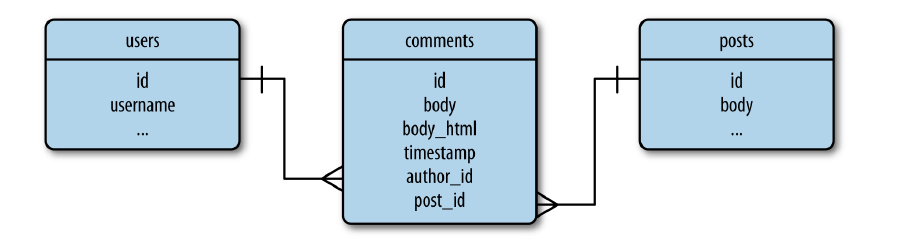

# 使用者評論

讓使用者能夠進行互動，是社群部落格的關鍵。

# 評論的資料庫表示法



- 和部落格文章相似，都有內文、作者、時間。
- comments是針對特定文章，因此要定義posts的一對多關係，也要利用此關係取得特定文章的評論清單。
- comments和user也是一對多關係，可取得某位使用者所撰寫的所有評論

# 建立相關模型

## Comment model

app/models.py

```python
class Comment(db.Model):
    __tablename__ = 'comments'
    id = db.Column(db.Integer, primary_key=True)
    body = db.Column(db.Text)
    body_html = db.Column(db.Text)
    timestamp = db.Column(db.DateTime, index=True, default=datetime.utcnow)
    disabled = db.Column(db.Boolean)  # 用來決定評論是否可以顯示
    author_id = db.Column(db.Integer, db.ForeignKey('users.id'))
    post_id = db.Column(db.Integer, db.ForeignKey('posts.id'))

    @staticmethod
    def on_changed_body(target, value, oldvalue, initiator):
        allowed_tags = ['a', 'abbr', 'acronym', 'b', 'code', 'em', 'i',
                        'strong']
        target.body_html = bleach.linkify(bleach.clean(
            markdown(value, output_format='html'),
            tags=allowed_tags, strip=True))
# 定義監聽事件 當評論改變時觸發 將markdown文字轉成html
db.event.listen(Comment.body, 'set', Comment.on_changed_body)
```

屬性和[Post model](https://www.notion.so/a6b9b65625fd476e966eb82379321877)幾乎相同，差一個disabled欄位。另外因為評論的ㄝ字數較少，因此可以允許的html 少了與段落有關的標籤，只留下格式化標籤。

## 修正使用者、文章和評論的一對多關係

app/models.py

```python
#．．．
class User(UserMixin, db.Model):
    __tablename__ = 'users'
    id = db.Column(db.Integer, primary_key=True)
    username = db.Column(db.String(64), unique=True, index=True)
    email = db.Column(db.String(64), unique=True, index=True)  # 讓使用者可以用email 登入
    role_id = db.Column(db.Integer, db.ForeignKey('roles.id'))
    password_hash = db.Column(db.String(128))
    confirmed = db.Column(db.Boolean, default=False)  # 帳號確認狀態
    name = db.Column(db.String(64))  # 本名
    location = db.Column(db.String(64))
    about_me = db.Column(db.Text())
    member_since = db.Column(db.DateTime(), default=datetime.utcnow)  # 建立時間
    last_seen = db.Column(db.DateTime(), default=datetime.utcnow)  # 上次訪問時間
    avatar_hash = db.Column(db.String(32))  # 儲存頭像URL用
    posts = db.relationship('Post', backref='author', lazy='dynamic')
    followed = db.relationship('Follow', foreign_keys=[Follow.follower_id],
                                         backref=db.backref('follower', lazy='joined'),
                                         lazy='dynamic',
                                         cascade='all, delete-orphan')
    followers = db.relationship('Follow', foreign_keys=[Follow.followed_id],
                                          backref=db.backref('followed', lazy='joined'),
                                          lazy='dynamic',
                                          cascade='all, delete-orphan')
    comments = db.relationship('Comment', backref='author', lazy='dynamic')  # 與評論的關係
# .....

class Post(db.Model):
    __tablename__ = 'posts'
    id = db.Column(db.Integer, primary_key=True)
    body = db.Column(db.Text) # 儲存markdown 格式文章
    body_html = db.Column(db.Text)  # 儲存html 格式文章
    timestamp = db.Column(db.DateTime, index=True, default=datetime.utcnow)
    author_id = db.Column(db.Integer, db.ForeignKey('users.id'))
    comments = db.relationship('Comment', backref='post', lazy='dynamic')  # 與評論的關聯

# .......
```

# 送出與顯示評論

各個文章網頁已經在[前面被設為永久連結](https://www.notion.so/a6b9b65625fd476e966eb82379321877)，網頁中也有一個提交表單，現在要再加入評論表單

app/main/forms.py

```python
# ......
class CommentForm(FlaskForm):  # 評論表單
    body = StringField('Enter your comment', validators=[DataRequired()])
    submit = SubmitField('Submit')
```

## 修改 post/<int:id> 路由加入對評論的支援

app/main/views.py

```python
from flask import render_template, redirect, url_for, abort, flash, request, current_app, make_response
from flask_login import login_required, current_user
from . import main
from .forms import EditProfileForm, EditProfileAdminForm, PostForm, CommentForm
from .. import db
from ..models import Permission, Role, User, Post, Comment
from ..decorators import admin_required, permission_required

# ...
@main.route('/post/<int:id>', methods=['GET', 'POST'])
def post(id):
    post = Post.query.get_or_404(id)
    form = CommentForm()  # 建立評論表單
    if form.validate_on_submit():
        comment = Comment(body=form.body.data,
                          post=post,
                          author=current_user._get_current_object())  # 回傳user 物件
        db.session.add(comment)
        db.session.commit()
        flash('Your comment has been published.')
        return redirect(url_for('.post', id=post.id, page=-1))  # page = -1 請求最後一頁 顯示剛才送出的評論
    page = request.args.get('page', 1, type=int)
    if page == -1:
        # 整數除後 再 +1
        page = (post.comments.count() - 1) // current_app.config['FLASKY_COMMENTS_PER_PAGE'] + 1

    # 用一對多關係 取得文章評論
    pagination = post.comments.order_by(Comment.timestamp.asc()).paginate(
                                        page, per_page=current_app.config['FLASKY_COMMENTS_PER_PAGE'],
                                        error_out=False)
    comments = pagination.items
		# 將評論與分頁物件傳入模板
    return render_template('post.html', posts=[post], form=form,
                           comments=comments, pagination=pagination)

# ...
```

設定評論每頁數量常數

config.py

```python
#．．．
FLASKY_COMMENTS_PER_PAGE = 20
＃...
```

## 評論模板

建立

新的部分模板 _comments.html，類似 _post.html 但使用不同的CSS。

app/templates/_comments.html

```html
<ul class="comments">
    
    <li class="comment">
        <div class="comment-thumbnail">
            <a href="{{ url_for('.user', username=comment.author.username) }}">
                
            </a>
        </div>
        <div class="comment-content">
            <div class="comment-date">{{ moment(comment.timestamp).fromNow() }}</div>
            <div class="comment-author"><a href="{{ url_for('.user', username=comment.author.username) }}">{{ comment.author.username }}</a></div>
            <div class="comment-body">
                
                    {{ comment.body_html | safe }}
                
                    {{ comment.body }}
                
            </div>
        </div>
    </li>
    
</ul>
```

將_posts.html 加上文章評論的連結

app/templates/_post.html

```html
<ul class="posts">
    
    <li class="post">
        <div class="post-thumbnail">
            <a href="{{ url_for('.user', username=post.author.username) }}">
                
            </a>
        </div>
        <div class="post-content">
            <div class="post-date">{{ moment(post.timestamp).fromNow() }}</div>
            <div class="post-author"><a href="{{ url_for('.user', username=post.author.username) }}">{{ post.author.username }}</a></div>
                    <div class="post-body">
                
                <!--    關閉html escape      -->
                    {{ post.body_html | safe }}
                
                    {{ post.body }}
                
        </div>
       <!--      將連結加在文章的下方      -->
            <div class="post-footer">
                
                <a href="{{ url_for('.edit', id=post.id) }}">
                    <span class="label label-primary">Edit</span>
                </a>
                
                <a href="{{ url_for('.edit', id=post.id) }}">
                    <span class="label label-danger">Edit [Admin]</span>
                </a>
                
                <a href="{{ url_for('.post', id=post.id) }}">
                    <span class="label label-default">Permalink</span>
                </a>
                <!--  連接到文章評論    -->
                <a href="{{ url_for('.post', id=post.id) }}#comments">
								<!--    透過關聯取得評論總數     -->
                    <span class="label label-primary">{{ post.comments.count() }} Comments</span>
                </a>
            </div>
    </li>
    
</ul>
```

評論連接的部分加入尾碼#comments 將構成文章的永久連結，最後一個部分稱為URL fragment，作用是指出文章的初始捲動位置。

瀏覽器會尋找有id的元素，並捲動頁面讓那個元素出現在網頁的最上面，將這個初始位置設為post.html模板的Comments首頁

被寫成<h4 id="comments">Comments</h4>.

原本的posts.html模板會引入 _comments.html，放在文章的下方

app/temlates/post.html

```html




Flasky - Post


<!--匯入文章-->

<h4 id="comments">Comments</h4>

<div class="comment-form">
    {{ wtf.quick_form(form) }}
</div>


<!--匯入評論 -->



<!--呼叫分頁巨集-->
<div class="pagination">
    {{ macros.pagination_widget(pagination, '.post', fragment='#comments', id=posts[0].id) }}
</div>


```

## 調整CSS

app/static/styles.css

```css
.profile-thumbnail {
    position: absolute;
}
.profile-header {
    min-height: 260px;
    margin-left: 280px;
}
div.post-tabs {
    margin-top: 16px;
}
ul.posts {
    list-style-type: none;
    padding: 0px;
    margin: 16px 0px 0px 0px;
    border-top: 1px solid #e0e0e0;
}
div.post-tabs ul.posts {
    margin: 0px;
    border-top: none;
}
ul.posts li.post {
    padding: 8px;
    border-bottom: 1px solid #e0e0e0;
}
ul.posts li.post:hover {
    background-color: #f0f0f0;
}
div.post-date {
    float: right;
}
div.post-author {
    font-weight: bold;
}
div.post-thumbnail {
    position: absolute;
}
div.post-content {
    margin-left: 48px;
    min-height: 48px;
}
div.post-footer {
    text-align: right;
}
ul.comments {
    list-style-type: none;
    padding: 0px;
    margin: 16px 0px 0px 0px;
}
ul.comments li.comment {
    margin-left: 32px;
    padding: 8px;
    border-bottom: 1px solid #e0e0e0;
}
ul.comments li.comment:nth-child(1) {
    border-top: 1px solid #e0e0e0;
}
ul.comments li.comment:hover {
    background-color: #f0f0f0;
}
div.comment-date {
    float: right;
}
div.comment-author {
    font-weight: bold;
}
div.comment-thumbnail {
    position: absolute;
}
div.comment-content {
    margin-left: 48px;
    min-height: 48px;
}
div.comment-form {
    margin: 16px 0px 16px 32px;
}
div.pagination {
    width: 100%;
    text-align: right;
    padding: 0px;
    margin: 0px;
}
div.flask-pagedown-preview {
    margin: 10px 0px 10px 0px;
    border: 1px solid #e0e0e0;
    padding: 4px;
}
div.flask-pagedown-preview h1 {
    font-size: 140%;
}
div.flask-pagedown-preview h2 {
    font-size: 130%;
}
div.flask-pagedown-preview h3 {
    font-size: 120%;
}
.post-body h1 {
    font-size: 140%;
}
.post-body h2 {
    font-size: 130%;
}
.post-body h3 {
    font-size: 120%;
}
.table.followers tr {
    border-bottom: 1px solid #e0e0e0;
}
```

## 修改db結構

```html
flask db migrate -m "add comment table"
flask db upgrade
```

在文章下方留下評論後轉跳的網址顯示

跳到最後面顯示剛剛留下的評論


該位使用者下方的文章評論數會更新


# 審核評論

在先前[設定角色權限](https://www.notion.so/051e09950843492482c3e9b274996a49)時，有一項是permission.MODERATE，用來判定是否有權限審核別人的評論。

## 導覽列加上Moderate Comments連結

將審核評論的功能加在導覽列上，並且設定只有擁有該權限的使用者才能看見。

### 修正base template

app/templates/base.html

```html
 <!-- 繼承Bootstrap的基礎模版 -->

Flasky


{{ super() }}
<link rel="shortcut icon" href="{{ url_for('static', filename='favicon.ico') }}" type="image/x-icon">
<link rel="icon" href="{{ url_for('static', filename='favicon.ico') }}" type="image/x-icon">
<link rel="stylesheet" type="text/css" href="{{ url_for('static', filename='styles.css') }}">



<div class="navbar navbar-inverse" role="navigation">
    <div class="container">
        <div class="navbar-header">
            <button type="button" class="navbar-toggle" data-toggle="collapse" data-target=".navbar-collapse">
                <span class="sr-only">Toggle navigation</span>
                <span class="icon-bar"></span>
                <span class="icon-bar"></span>
                <span class="icon-bar"></span>
            </button>
            <a class="navbar-brand" href="{{ url_for('main.index') }}">Flasky</a>
        </div>
        <div class="navbar-collapse collapse">
            <ul class="nav navbar-nav">
                <li><a href="{{ url_for('main.index') }}">Home</a></li>
                
                <!--        登入下才能看到個人資訊頁        -->
                <li><a href="{{ url_for('main.user', username=current_user.username) }}">Profile</a></li>
                
            </ul>
            <ul class="nav navbar-nav navbar-right">
                <!--     修改評論連結     -->
                
                <li><a href="{{ url_for('main.moderate') }}">Moderate Comments</a></li>
                
                
                <!--  登入狀況下提供下拉選單   -->
                <li class="dropdown">
                        <!--   增加avatar 圖像       -->
                     <a href="#" class="dropdown-toggle" data-toggle="dropdown">
                        
                        Account <b class="caret"></b>
                    </a>
                    <ul class="dropdown-menu">
                        <li><a href="{{ url_for('auth.change_password') }}">Change Password</a></li>
                        <li><a href="{{ url_for('auth.change_email_request') }}">Change Email</a></li>
                        <li><a href="{{ url_for('auth.logout') }}">Log Out</a></li>
                    </ul>
                </li>
                
                <li><a href="{{ url_for('auth.login') }}">Log In</a></li>
                
            </ul>
        </div>
    </div>
</div>



<div class="container">
    
    <div class="alert alert-warning">
        <button type="button" class="close" data-dismiss="alert">&times;</button>
        {{ message }}
    </div>
    

    
</div>



{{ super() }}
{{ moment.include_moment() }}

```

### 審核評論路由

讓審核網頁可以顯示文章由新到舊的評論，從資料庫讀取一頁的評論，放入模板

app/main/views.py

```python
# 評論審核路由
@main.route('/moderate')
@login_required
@permission_required(Permission.MODERATE)
def moderate():
    page = request.args.get('page', 1, type=int)
    pagination = Comment.query.order_by(Comment.timestamp.desc()).paginate(
        page, per_page=current_app.config['FLASKY_COMMENTS_PER_PAGE'],
        error_out=False)
    comments = pagination.items
    return render_template('moderate.html', comments=comments,
                           pagination=pagination, page=page)
```

## 審核評論模板

### 建立 moderate 審核模板

建立moderate.html 並使用前面做好的_comments.html 子模板

app/templates/moderate.html

```html



Flasky - Comment Moderation


<div class="page-header">
    <h1>Comment Moderation</h1>
</div>
<!-- 定義模板變數 -->




<div class="pagination">
    {{ macros.pagination_widget(pagination, '.moderate') }}
</div>


```

在此將模板變數 moderate 設為true ，讓 _comments.html 子模板可以用此變數判斷是否要轉譯( rendered )

### 修改子模板-顯示是否顯示評論按鈕

在板主權限下，( moderate 設為True ) 無論是否禁止都要能夠看到，並且提供按鈕切換。

而一般使用者( moderate 未設定) 不能看到標記為disabled的評論 

app/templates/_comments.html 

```html
<ul class="comments">
    
    <li class="comment">
        <div class="comment-thumbnail">
            <a href="{{ url_for('.user', username=comment.author.username) }}">
                
            </a>
        </div>
        <div class="comment-content">
            <div class="comment-date">{{ moment(comment.timestamp).fromNow() }}</div>
            <div class="comment-author"><a href="{{ url_for('.user', username=comment.author.username) }}">{{ comment.author.username }}</a></div>
            <div class="comment-body">
                <!--  判斷是否可以顯示評論 -->
                
                <p><i>This comment has been disabled by a moderator.</i></p>
                
                
                
                    
                        {{ comment.body_html | safe }}
                    
                        {{ comment.body }}
                    
                
            </div>
            <!--      判斷是否顯示評論顯示/禁止按鈕      -->
            
                <br>
                
                <a class="btn btn-default btn-xs" href="{{ url_for('.moderate_enable', id=comment.id, page=page) }}">Enable</a>
                
                <a class="btn btn-danger btn-xs" href="{{ url_for('.moderate_disable', id=comment.id, page=page) }}">Disable</a>
                
            
        </div>
    </li>
    
</ul>
```

使用者會看到評論被隱藏的訊息，而版主可以看到所有內容。並且透過按鈕可以切換評論的禁止狀態，不同狀態會呼叫不同的路由。

## 變更審核狀態路由

app/main/views.py

```python
# 變更評論許可狀態
@main.route('/moderate/enable/<int:id>')
@login_required
@permission_required(Permission.MODERATE)
def moderate_enable(id):
    comment = Comment.query.get_or_404(id)
    comment.disabled = False
    db.session.add(comment)
    db.session.commit()
    return redirect(url_for('.moderate',
                            page=request.args.get('page', 1, type=int)))

@main.route('/moderate/disable/<int:id>')
@login_required
@permission_required(Permission.MODERATE)
def moderate_disable(id):
    comment = Comment.query.get_or_404(id)
    comment.disabled = True
    db.session.add(comment)
    db.session.commit()
    return redirect(url_for('.moderate',
                            page=request.args.get('page', 1, type=int)))
```

當disabled 的值被改寫後，會轉址回 (redirect back) 審核網頁，若query有收到page引述，就會納入轉址