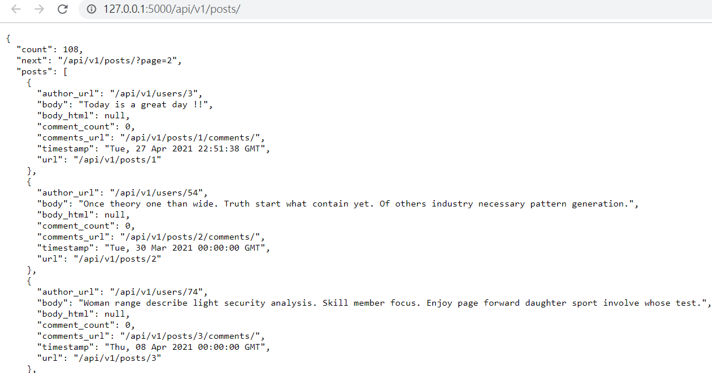

# 建立RESTful API

使用route裝飾器與methods引數宣告URL的路由

使用JSON接收或回傳回應

在URL中添加版本號區分以相容新舊api

# 建立API藍圖

與RESTful有關了路由是獨立的app子集合，所以最好是放在專屬的藍圖中維持良好結構

## api結構圖

|-flasky
    |-app/
         |-api
             |-**init**.py
             |-users.py
             |-posts.py
             |-comments.py
             |-authentication.py
             |-errors.py
             |-decorators.py

要注意API使用的套件有版本號，如果將來要加入無法回溯相容的API版本，可以讓他加入獨立的套件使用不同的版本號，將這兩個API都放入APP

## 建立API藍圖

api藍圖會在獨立的module 中實作每一種資源，包含身分驗證、錯誤處理、提供自訂裝飾器的功能

app/api/__init__

```python
from flask import Blueprint

api = Blueprint('api', __name__)

from . import authentication, posts, users, comments, errors
```

匯入藍圖的所有組件( components )，來註冊路由與其他handler

app/__init__.py

```python
from flask import Flask
from flask_bootstrap import Bootstrap
from flask_mail import Mail
from flask_moment import Moment
from flask_sqlalchemy import SQLAlchemy
from config import config
from flask_login import LoginManager
from flask_pagedown import PageDown

bootstrap = Bootstrap()
mail = Mail()
moment = Moment()
db = SQLAlchemy()
pagedown = PageDown()

# 初始化 flask login
login_manager = LoginManager()
login_manager.login_view = 'auth.login'

def create_app(config_name):
    app = Flask(__name__)
    app.config.from_object(config[config_name])
    config[config_name].init_app(app)

    bootstrap.init_app(app)
    mail.init_app(app)
    moment.init_app(app)
    db.init_app(app)
    login_manager.init_app(app)
    pagedown.init_app(app)

    from .main import main as main_blueprint
    app.register_blueprint(main_blueprint)

    from .auth import auth as auth_blueprint
    app.register_blueprint(auth_blueprint, url_prefix='/auth')  # 補上url前置路徑
    
    from .api import api as api_blueprint  # api 放在最後 避免依賴錯誤
    app.register_blueprint(api_blueprint, url_prefix='/api/v1')  # url 加上前置路徑與版本號

    return app
```

用URL前致詞註冊API藍圖，讓所有的URL都用api/v1開頭。

在註冊藍圖時使用前置詞，就不用把版本號寫在每一個藍圖路由裡面。

# 錯誤處理

RESTful web service 會用回應傳送適當的狀態碼與內文，將請求的狀態告訴用戶端。

## 常見的HTTP回應狀態碼

HTTP回應狀態碼

```markdown
| 狀態碼 | 名稱                  | 說明                                             |                                      |
|--------|-----------------------|--------------------------------------------------|--------------------------------------|
| 200    | OK                    | request 已成功完成                               |                                      |
| 201    | Created               | request 已成功完成並且建立一個新資源             |                                      |
| 202    | Accepted              | request 被接受，但仍在處理中，且會非同步進行                                         |  |
| 204    | No Content            | request 成功完成，且回應中沒有回傳的資料         |                                      |
| 400    | Bad Request           | request 無效或不一致                             |                                      |
| 401    | Unauthorized          | request 沒有身分驗證資訊，或用戶端提供無效的憑證 |                                      |
| 403    | Foribidden            | request 送來的身分驗證憑證不足以處理             |                                      |
| 404    | Not Found             | 找不到URL參考的資源                              |                                      |
| 405    | Method Not Allowed    | 請求的方法不支持指定的資源                       |                                      |
| 500    | Internal Server Error | 處理request時發生意外的錯誤                      |                                      |
```

404或500這種錯誤通常是flask自己產生的，會回應一個HTML格式，而非預期的JSON，造成API用戶端的混亂

## 內容協商 ( negotiation)

讓錯誤處理常式 ( error handlers ) 根據用戶端請求的格式產生適當的回應，這種技術稱為內容協商。

來自 web service clients 回應 JSON

來自其他的 回應 HTML

### [修改之前的錯誤處理](https://www.notion.so/Templates-aa167bf524004e1eb920206d9fea97e7)

app/main/errors.py

```python
from flask import render_template, request, jsonify
from . import main

@main.app_errorhandler(403)
def forbidden(e):
    # 判斷用戶希望的回傳格式
    if request.accept_mimetypes.accept_json and not request.accept_mimetypes.accept_html:
        # 只幫 接受JSON 不接受HTML的用戶產生JSON 回應
        response = jsonify({'error': 'forbidden'})
        response.status_code = 403
        return response
    return render_template('403.html'), 403

@main.app_errorhandler(404)
def page_not_found(e):
    if request.accept_mimetypes.accept_json and not request.accept_mimetypes.accept_html:
        response = jsonify({'error': 'not found'})
        response.status_code = 404
        return response
    return render_template('404.html'), 404

@main.app_errorhandler(500)
def internal_server_error(e):
    if request.accept_mimetypes.accept_json and not request.accept_mimetypes.accept_html:
        response = jsonify({'error': 'internal server error'})
        response.status_code = 500
        return response
    return render_template('500.html'), 500
```

更新的error handler 會檢查accept請求的 header，並解碼成requeset.accept_mimetypes來了解用戶端希望收到的回應格式。

瀏覽器通常不會限制回應的格式，但API用戶端通常會

### 新增api藍圖中的 error handle

app/api/errors.py

```python
from flask import jsonify
from app.exceptions import ValidationError
from . import api

def bad_request(message):
    response = jsonify({'error': 'bad request', 'message': message})
    response.status_code = 400
    return response

def unauthorized(message):
    response = jsonify({'error': 'unauthorized', 'message': message})
    response.status_code = 401
    return response

def forbidden(message):
    response = jsonify({'error': 'forbidden', 'message': message})
    response.status_code = 403
    return response

@api.errorhandler(ValidationError)
def validation_error(e):
    return bad_request(e.args[0])
```

api藍圖中的view 函式可以在必要的時候呼叫error module 這些helper functions 產生錯誤回應

# 用Flask-HTTPAuth 驗證使用者

- 一般web 服務都要保護某些資訊，確保只有通過驗證的使用者可以取得。
- RIAs (Rich Internet Applications) 必須要求使用者提供登入憑證，並將這些憑證傳給伺服器做驗證。
- RESTful web services 是無狀態的，server 在不同的request 不能記得用戶端的任何資訊，因此用戶端必須在request中提供憑證才能執行

在先前實作的登入功能會將資料存在session中，在預設情況下Flask 會將他存放在用戶cookie，因此server不會儲存與使用者相關的任何訊息，而是讓用戶端保存。

但在RESTful web services 中使用cookie會進入灰色地帶，因為對於非web 瀏覽器的用戶端很難做到。

API中不應該使用cookie

RESTful 結構是用HTTP協定為基礎，因此HTTP驗證是首選的憑證傳送方式，無論Basic 或是 Digest 都是將憑證放在所有request的Authorization中

## 安裝與初始化

```bash
pip install flask-httpauth
```

要初始化HTTP Basic 身分驗證的擴充套件，需要先建立HTTPBasicAuth物件。

和Flask-Login一樣，Flask-HTTPAuth，沒有指定驗證使用者憑證所需的程序，所以這資訊是由callback function 所提供的。

app/api/authentication.py

```python
from flask import g, jsonify
from flask_httpauth import HTTPBasicAuth
from ..models import User
from . import api

auth = HTTPBasicAuth()
```

因為這種使用者驗證方式只會在API藍圖中使用，所以只在藍圖套件 ( package )中初始化。

### 驗證密碼

```python
# .... 接續上方
@auth.verify_password
def verify_password(email_or_token, password):
    if email == '':
        return False

    user = User.query.filter_by(email = email).first()
    if not user:
        return False
    g.current_user = user
    return user.verify_password(password)
```

透過User model 既有的功能驗證 email 和 password。這個驗證callback會在有效登入時回傳True 否則為False。

Flask-HTTPAuth 擴充套件也可以為不執行身分驗證的request呼叫callback function，此時會將兩個引數設為空字串，當email為空字串時，會回傳Flase凍結(block) request。有些app接受匿名使用者所以會回傳True。

身分驗證的callback 會將通過驗證的使用者存在Flask 的g context變數中，讓view函式可以讀取。

因為各個request使用不同的使用者憑證，所以要用 secure HTTP 公開API路由，才能在傳輸過程中加密所有的request與回應

### error handler

當身分驗證憑證無效時，Flask-HTTPAuth在預設狀態會回傳401給用戶端

為了確保這個回應與API回傳的其他錯誤一致，因此要自行編寫錯誤回應

```python
# ...接續上方
from .errors import unauthorized, forbidden

@auth.error_handler
def auth_error():
    return unauthorized('Invalid credentials')
```

藍圖的所有路由都要用auth.login_required裝飾器保護，因此在藍圖的before_request handler裡面 include

另外也要拒絕已經通過驗證，但沒有確認帳號的使用者 ([透過user.confirmed](https://www.notion.so/4578c59cd0bf455e83eb2707af1f487c)) 

```python
# ...
@api.before_request
@auth.login_required
def before_request():
    if not g.current_user.is_anonymous and not g.current_user.confirmed:
        return forbidden('Unconfirmed account')
```

# 用權杖驗證身分(token-based authentication)

為了避免不斷傳送密碼這種敏感資訊，而使用權杖驗證(token-based authentication)

進行token-based驗證時，用戶端要傳送包含登入憑證(login credentails)的request 來驗證自己並取得 access token，再用access token取代登入憑證來驗證request。

token在發送時也會傳送過期時間，當tokne到期時就需要重新進行驗證才能取得新的權杖。這樣也可以藉由調整token的過期時間來控制token被竊取的風險

## User 添加token驗證功能

在user models中透過[itsdnagerous](https://www.notion.so/4578c59cd0bf455e83eb2707af1f487c) 加入兩個方法來產生和驗證token

```python
class User(UserMixin, db.Model):
    def generate_auth_token(self, expiration):  # 產生驗證token
        s = Serializer(current_app.config['SECRET_KEY'], expires_in=expiration)
        return s.dumps({'id': self.id}).decode('utf-8')

    @staticmethod
    def verify_auth_token(token):  # 驗證token
        s = Serializer(current_app.config['SECRET_KEY'])
				# 確認有效後回傳 user_id
        try:
            data = s.loads(token)
        except:
            return None
        return User.query.get(data['id'])
```

產生經過SECRET_KEY 加密，裡面含有user_id 和 過期秒數的token。

## 改善身分驗證-支援token

為了驗證和token一起送來的request，必須修改Flask-HTTPAuth的verify_password callback，來接收token與一般的憑證

app/api/authentication.py

```python
from flask import g, jsonify
from flask_httpauth import HTTPBasicAuth
from ..models import User
from . import api
from .errors import unauthorized, forbidden

auth = HTTPBasicAuth()

@auth.verify_password
def verify_password(email_or_token, password):
    if email_or_token == '':  # 驗證身分可使用email 地址或 token 
        return False

    if password == '':  # 密碼為空 表示是用token 進行驗證
        g.current_user = User.verify_auth_token(email_or_token)
        g.token_used = True  # 判斷是否啟用token
        return g.current_user is not None

    # 都不為空 表示 一般的email和密碼驗證
    user = User.query.filter_by(email=email_or_token.lower()).first()
    if not user:
        return False
    g.current_user = user
    g.token_used = False
    return user.verify_password(password)

@api.before_request
@auth.login_required
def before_request():
    if not g.current_user.is_anonymous and not g.current_user.confirmed:
        return forbidden('Unconfirmed account')

@api.route('/tokens/', methods=['POST'])
def get_token(): # 回傳身分驗證token
    if g.current_user.is_anonymous or g.token_used:
        return unauthorized('Invalid credentials')
		# 以json形式回傳 token 與 過期時間
    return jsonify({'token': g.current_user.generate_auth_token(expiration=3600), 'expiration': 3600})
```

verify_password( ) 中token驗證是選用的，由用戶端透過email_or_tokne 和 password決定是否使用。為了讓view函式可以分辨是tokne 驗證 還是email與密碼驗證，加入g.token_used變數。

get_token( ) 因為在同一個藍圖中也會使用 [before_request]() 的身分驗證機制，另外為了防止用戶使用之前取得的token 而不是email 與 密碼來驗證這個路由，透過檢查g.token_used ，拒絕以token發送的request。

避免用舊的token 取得新的token避免token過期。

# 將資源序列化成JSON

將內部資源的表示法轉換成JSON這類的傳輸格是稱為序列化 (serialization)

## 讓Post 與 User 回傳JSON

app/models.php

```python
from app.exceptions import ValidationError
from flask import current_app, request, url_for

# .....

class User(UserMixin, db.Model):
		def to_json(self):
	        json_user = {
	            'url': url_for('api.get_user', id=self.id),
	            'username': self.username,
	            'member_since': self.member_since,
	            'last_seen': self.last_seen,
	            'posts_url': url_for('api.get_user_posts', id=self.id),
	            'followed_posts_url': url_for('api.get_user_followed_posts',
	                                          id=self.id),
	            'post_count': self.posts.count()
	        }
	        return json_user

class Post(db.Model):		
		def to_json(self):
        json_post = {
            'url': url_for('api.get_post', id=self.id),
            'body': self.body,
            'body_html': self.body_html,
            'timestamp': self.timestamp,
            'author_url': url_for('api.get_user', id=self.author_id),
            'comments_url': url_for('api.get_post_comments', id=self.id),
            'comment_count': self.comments.count()
        }
        return json_post

    @staticmethod
    def from_json(json_post):
        body = json_post.get('body')
        if body is None or body == '': # 資料缺少時直接拋出錯誤 由error handler處理
            raise ValidationError('post does not have a body')
        return Post(body=body)
```

在post class

to_json( ) 中的url, author_url, comments_url欄位都需要回傳各自的資源URL，所以呼叫url_for( ) 由API藍圖中所定義的路由來產生( [在下方小節]() )。

from_json( ) 中只使用 body屬性

- 忽略body_html屬性，因為當body被修改時，SQLAchemy事件會自動觸發伺服器的Markdown轉譯。
- 不使用timestamp因為用戶無法貼出過去或將來的文章。
- 不使用author_url 因為用戶端無法選擇文章的作者，只能是自己。
- comments_url 和 comment_count屬性是由資料庫關係自動產生的。
- 忽略 url 因為資源的url 是由伺服器定義的而不是用戶端。

若出現body 缺少拋出自己寫的ValidationError class 並繼承Python 的 ValueError的子類別。

app/exceptions.py

```python
class ValidationError(ValueError):
    pass
```

由app提供適當地回應給用戶端來處裡異常，用Flask的errorhandler裝飾器安裝一個全域異常處理程序。

app/api/errors.py

```python
@api.errorhandler(ValidationError)
def validation_error(e):
    return bad_request(e.args[0])
```

errorhandler和處理HTTP狀態碼的相同，只是在這邊會接受Exception類別引數，且只會在處理api藍圖路由發生異常的時候執行

因此可以改寫成不需要加入錯誤檢查的view 函式

```python
@api.route('/posts/', methods=['POST'])
@permission_required(Permission.WRITE)
def new_post():
    post = Post.from_json(request.json)
    post.author = g.current_user
    db.session.add(post)
    db.session.commit()
    return jsonify(post.to_json()), 201, {'Location': url_for('api.get_post', id=post.id)}
```

在這邊呼叫post.from_json() 的時候 就會透過上面的步驟執行錯誤檢查了

# 實作資源路由 (Implementing Resource Endpoints)

## 取得文章 ( GET resource handlers )

app/api/posts.py

```python
@api.route('/posts/<int:id>')
def get_post(id):
    post = Post.query.get_or_404(id)
    return jsonify(post.to_json())

@api.route('/posts/')
def get_posts():
    page = request.args.get('page', 1, type=int)
    pagination = Post.query.paginate(
        page, per_page=current_app.config['FLASKY_POSTS_PER_PAGE'],
        error_out=False)
    posts = pagination.items
    prev = None
    if pagination.has_prev:
        prev = url_for('api.get_posts', page=page-1)
    next = None
    if pagination.has_next:
        next = url_for('api.get_posts', page=page+1)
    return jsonify({
        'posts': [post.to_json() for post in posts],
        'prev': prev,
        'next': next,
        'count': pagination.total
    })

```

第一個路由會回傳一篇部落格文章，找不到時回傳404錯誤

第二個路由是回傳資源合集(collection of resources) 的GET request，在處理這種大型的集合時，可能會極度消耗資源且難以管理，因此可將其分頁處理。由prev_url 和 next_url 分別存取上一頁與下一頁資源的URL，count是所有資源的總數量。此種做法可以用在回傳集合的所有路由上

## 新建文章 (POST resource handler)

app/api/posts.py

```python
@api.route('/posts/', methods=['POST'])
@permission_required(Permission.WRITE)
def new_post():
    post = Post.from_json(request.json)
    post.author = g.current_user
    db.session.add(post)
    db.session.commit() # 將post寫入db後 下面才會有辦法取得post.id 產生url
    return jsonify(post.to_json()), 201, {'Location': url_for('api.get_post', id=post.id)}
```

這個函式被包在permission_requred裝飾器中(下方區塊)，以確保通過驗證的使用者有編寫文章的權限。

先前已經寫過error handler 所以不用再加其他錯誤判斷處理。

部落格的文章由json 建立，作者為通過驗證的使用者 (g.current_user) 

寫入db 取得post.id 回傳201

app/api/decorators.py

```python
from functools import wraps
from flask import g
from .errors import forbidden

def permission_required(permission):
    def decorator(f):
        @wraps(f)
        def decorated_function(*args, **kwargs):
            if not g.current_user.can(permission):
                return forbidden('Insufficient permissions')
            return f(*args, **kwargs)
        return decorated_function
    return decorator
```

防止未經授權的使用者建立新文章的permission_required裝飾器，與網站使用的很像但這邊只給api使用

## 編輯既有文章 (PUT resource handler)

app/api/decorators.py

```python
@api.route('/posts/<int:id>', methods=['PUT'])
@permission_required(Permission.WRITE)
def edit_post(id):
    post = Post.query.get_or_404(id)
    # 要先檢查是否為user 或是管理員
    if g.current_user != post.author and not g.current_user.can(Permission.ADMIN):
        return forbidden('Insufficient permissions')
    post.body = request.json.get('body', post.body)
    db.session.add(post)
    db.session.commit()
    return jsonify(post.to_json())
```

如果很多個view函式都需要做同樣的檢查，最好寫成裝飾器，避免重複

# API resources

API 清單

```markdown
| URL                      | 方法 | 說明                         |
|--------------------------|------|------------------------------|
| /users/                  | GET  | 回傳一位使用者               |
| /users/\<int:id\>/posts/ | GET  | 回傳某位使用者撰寫的所有文章 |
| /users/\<int:id\>/timeline/        | GET  | 回傳某位使用者追隨的所有文章 |
| /posts/                  | GET  | 回傳所有部落格文章           |
| /posts/                  | POST | 建立一篇新的部落格文章       |
| /posts/                  | GET  | 回傳一篇部落格文章           |
| /posts/                  | PUT  | 修改一篇部落格文章           |
| /posts/\<int:id\>/comments/        | GET  | 回傳一篇部落格文章的評論     |
| /posts/\<int:id\>/comments/        | POST | 幫一篇部落格文章加上評論     |
| /comments/               | GET  | 回傳所有評論                 |
| /comments/\<int:id\>              | GET  | 回傳一篇評論                 |
```

# 用HTTPie測試API

```bash
pip install httpie
```

```bash
(venv) D:\flask_learning2>http --json --auth <email>:<password> GET http://127.0.0.1:5000/api/v1/posts
HTTP/1.0 308 PERMANENT REDIRECT
Content-Length: 277
Content-Type: text/html; charset=utf-8
Date: Sat, 01 May 2021 11:28:55 GMT
Location: http://127.0.0.1:5000/api/v1/posts/
Server: Werkzeug/1.0.1 Python/3.8.5

<!DOCTYPE HTML PUBLIC "-//W3C//DTD HTML 3.2 Final//EN">
<title>Redirecting...</title>
<h1>Redirecting...</h1>
<p>You should be redirected automatically to target URL: <a href="http://127.0.0.1:5000/api/v1/posts/">http://127.0.0.1:5000/api/v1/posts/</a>.  If not click the link
.
```

跳出瀏覽器 輸入帳號密碼

可看到結果

