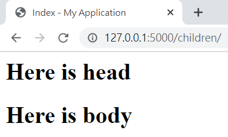

# Templates

# render_template

flask 使用Jinja2模板引擎

可用pycharm設定環境變數 FLASK_APP=hello.py;FLASK_ENV=development

也可用terminal設定

```bash
set FLASK_APP=hello.py
set FLASK_DEBUG=1
```

set FLASK_DEBUG=1 和 FLASK_ENV=development 同樣功能

[hello.py](http://hello.py) 入口頁面 (要執行的檔案)

```python
from flask import Flask
from flask import render_template #轉跳頁面用的套件

app = Flask(__name__)

@app.route("/")  # 根目錄
def hello():
    return render_template('index.html') #轉跳頁面位置

@app.route("/user/<name>")  #  <name> 是接網址 /user/後面的字串
def hello():
    return render_template('user.html',name=name) #第一個引數是轉跳頁面,其他都是用key-value表示要帶入的變數
```

templates/index.html

```html
<h1>Hello world!</h1>
```

templates/user.html

```html
<h1>Hello {{name}}!</h1>
```

{{ }} 的佔位符號表示此處的值要從送入的資料取得

# filter過濾器

變數名稱後面 | 字元所帶的關鍵字,可對變數做處理

[關鍵字列表](https://jinja.palletsprojects.com/en/2.11.x/templates/#builtin-filters)

```html
<h1>Hello {{name|capitalize}}!</h1>
```

其中safe關鍵字是讓變數不轉義，預設是會轉義所有變數

若變數裡面帶的是html 格式的字串，就必須下safe才能在頁面中正常顯示

safe在有安全餘慮的時候不能使用，ex 讓使用者輸入的表單

# Html中的控制結構

一定都要用end結尾

if else

```python

	Hello, {{ user }}

	Hello,Stranger!

```

for loop

```python
<ul>
	
	<li>{{ comment }}</li>
	
</ul>
```

也可使用macro 的巨集( 暫略)

# 模板繼承

base.html 基礎模板

```html
<html>
    <head>
        
        <title> - My Application</title>
				<h1>Here is head</h1>
        
    </head>
    <body>
        
        
    </body>

</html>
```

每個區塊都由  開始 到結束

繼承的模板用同樣的名稱定義區塊

子模板

chird.html

```html
  <!-- 宣告要繼承的模板 -->
Index <!-- head區域更改title標籤的block -->

    {{ super() }} <!-- 呼叫base模板的內容 -->
    <style></style>


    <h1>Here is body</h1>

```

有使用super() 才能引用base.html head區塊的內容

若將super() 註解 head區塊中title的Index字串和h1標籤的內容都不會出現




# Flask-Bootstrap

在flask中使用Bootstrap, [官網](https://getbootstrap.com/)

```bash
pip install flask-bootstrap
```

## bootstrap 初始化

要先將套件綁定給app

[hello.py](http://hello.py) 入口頁面

```python
from flask import Flask
from flask import render_template #轉跳頁面用的套件
from flask_bootstrap import Bootstrap # 匯入bootstrap套件

app = Flask(__name__)
bootstrap = Bootstrap(app) #將實例化的app傳入建構式

@app.route("/")  
def hello():
    return render_template('index.html') 

@app.route("/user/<name>")  #  <name> 是接網址 /user/後面的字串
def hello():
    return render_template('user.html',name=name) #第一個引數是轉跳頁面,其他都是用key-value表示要帶入的變數
```

初始化後app就可以使用包含所有Bootstrap檔案和通用結構的基礎模板

用Jinja2的模板繼承Bootstrap的基礎模版

templates/user.html

一共有title, navbar,  content 三個區塊可供定義

```html
 <!-- 繼承Bootstrap的基礎模版 -->

Flasky


<div class="navbar navbar-inverse" role="navigation">
    <div class="container">
        <div class="navbar-header">
            <button type="button" class="navbar-toggle" data-toggle="collapse" data-target=".navbar-collapse">
                <span class="sr-only">Toggle navigation</span>
                <span class="icon-bar"></span>
                <span class="icon-bar"></span>
                <span class="icon-bar"></span>
            </button>
            <a class="navbar-brand" href="/">Flasky</a>
        </div>
        <div class="navbar-collapse collapse">
            <ul class="nav navbar-nav">
                <li><a href="/">Home</a></li>
            </ul>
        </div>
    </div>
</div>



<div class="container">
    <div class="page-header">
        <h1>Hello, {{ name }}!</h1>
    </div>
</div>

```


Flask-Bootstrap 基礎模板區塊

```markdown
| Block name   | Outer Block | Purpose                                            |
|--------------|-------------|----------------------------------------------------|
| doc          |             | Outermost block.                                   |
| html         | doc         | Contains the complete content of the               |
| html_attribs | doc         | Attributes for the HTML tag.                       |
| head         | doc         | Contains the complete content of the               |
| body         | doc         | Contains the complete content of the               |
| body_attribs | body        | Attributes for the Body Tag.                       |
| title        | head        | Contains the complete content of the               |
| styles       | head        | Contains all CSS style                             |
| metas        | head        | Contains all                                       |
| navbar       | body        | An empty block directly above content.             |
| content      | body        | Convenience block inside the body. Put stuff here. |
| scripts      | body        | Contains all                                       |
```

style 和 scripts是Brootstrap宣告 CSS 和 JS 的地方
若要在 style 和 script 加入自己的內容要使用 super()

```html

{{ super() }}
<script type="text/javascript" src="my-script.js"></script>

```

# 自訂錯誤網頁

## 用app.errorhandler裝飾器處理

[hello.py](http://hello.py) 入口頁面

```bash
@app.errorhandler(404) # 若出現404錯誤轉導到此
def page_not_found(e):
    return render_template('404.html'),404 # 轉導頁面, status code 

@app.errorhandler(500)
def internal_server_error(e):
    return render_template('500.htnl'),500
```

使用模板繼承的方式 簡化各種錯誤的模板內容

templates/base.html

```html
 <!-- 繼承Bootstrap的基礎模版 -->

Flasky


<div class="navbar navbar-inverse" role="navigation">
    <div class="container">
        <div class="navbar-header">
            <button type="button" class="navbar-toggle" data-toggle="collapse" data-target=".navbar-collapse">
                <span class="sr-only">Toggle navigation</span>
                <span class="icon-bar"></span>
                <span class="icon-bar"></span>
                <span class="icon-bar"></span>
            </button>
            <a class="navbar-brand" href="/">Flasky</a>
        </div>
        <div class="navbar-collapse collapse">
            <ul class="nav navbar-nav">
                <li><a href="/">Home</a></li>
            </ul>
        </div>
    </div>
</div>



<div class="container">
    <div class="page-header">
          <!-- 主要更換的部分 -->
    </div>
</div>

```

templates/404.html (500 同樣做法)

```html

Flasky - Page Not Found


<div class="page-header">
	<h1>Not Found</h1>
</div>

```

簡化user模板

templates/user.html

```html

Flasky


<div class="page-header">
	<h1>Hello, {{ name }}</h1>
</div>

```

# url_for() 取得路徑

模板中的url 為了避免route檔案的內容一更改就失效, 或避免大量更改檔案

```python
url_for('index') # 回傳 /
url_for('index', _external=True) # 回傳 http://localhost:5000
```

一般在app內部使用只需要相對路徑
通常在連往外部時才使用絕對路徑

產生動態連結

用關鍵字引述傳入會變動的部分 ex. name

```python
url_for('user', name='john', _external=True) # http://localhost:5000/user/john
```

也可傳入其他查詢字串

```python
url_for('user', name='john',page=2,version=1) # http://localhost:5000/user/john?page=2&version=1
```

# 靜態檔案

圖片, JS, CSS檔案預設會放在app根目錄的static中

```python
url_for('static',filename='css/styles.css',external=Ture)
# 回傳http://localhost:5000/static/css/styles.css
```

# Flask-Moment 將時間本地化

由於

瀏覽器可以讀取使用者電腦的時區設定

因此直接將這些時間單位傳給瀏覽器做轉換比較適合

[Moment.js](https://momentjs.com/) 是用JS寫的原始套件 Flask-Moment是python專用的工具 

```bash
pip install flask-moment
```

## Flask-Moment初始化

方法類似Flask-Bootstrap , 要先將套件綁定給app

```python
from flask import Flask
from flask import render_template #轉跳頁面用的套件
from flask_bootstrap import Bootstrap # 匯入bootstrap套件
from flask_moment import Moment
from datetime import datetime

app = Flask(__name__)
bootstrap = Bootstrap(app) #將實例化的app傳入建構式
moment = Moment(app)

@app.route("/")  
def hello():
    return render_template('index.html',current_time=datetime.utcnow()) 
```

Flask-Moment 需要引入 jQuery.js
但Bootstrap已經有引入了，因此此處不須處理 

templates/index.html

```html


<!--include moment 要先匯入-->

{{ super() }}
{{ moment.include_moment() }}

<!--include moment end-->

Flasky

<div class="navbar navbar-inverse" role="navigation">
    <div class="container">
        <div class="navbar-header">
            <button type="button" class="navbar-toggle" data-toggle="collapse" data-target=".navbar-collapse">
                <span class="sr-only">Toggle navigation</span>
                <span class="icon-bar"></span>
                <span class="icon-bar"></span>
                <span class="icon-bar"></span>
            </button>
            <a class="navbar-brand" href="/">Flasky</a>
        </div>
        <div class="navbar-collapse collapse">
            <ul class="nav navbar-nav">
                <li><a href="/">Home</a></li>
            </ul>
        </div>
    </div>
</div>



<div class="container">
    <div class="page-header">
<!--        <h1>Hello, {{ name }}!</h1>-->
        <h1>Hello World!</h1>
        <h2>current time is {{current_time}}</h2>
        <p>The first format.('L') local date and time is <b>{{ moment(current_time).format('L') }}</b></p>
        <p>The second format.('LL') local date and time is <b>{{ moment(current_time).format('LL') }}</b></p>
        <p>The third format.('LLL') local date and time is <b>{{ moment(current_time).format('LLL') }}</b></p>
        <p>The forth format.('LLLL') local date and time is <b>{{ moment(current_time).format('LLLL') }}</b></p>
        <p>That was {{ moment(current_time).fromNow(refresh=True) }}</p>
        <!-- fromNow 會轉譯時間  refresh=True 會持續更新
        從a few seconds ago->a minute ago -> 2 minutes ago    -->
    </div>
</div>

```

結果顯示

**Hello World!**

**current time is 2021-04-13 14:36:14.824156**

The first format.('L') local date and time is **04/13/2021**

The second format.('LL') local date and time is **April 13, 2021**

The third format.('LLL') local date and time is **April 13, 2021 10:36 PM**

The forth format.('LLLL') local date and time is **Tuesday, April 13, 2021 10:36 PM**

That was a minute ago