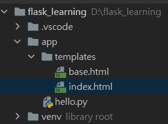

# Web表單

可參考

[https://medium.com/pyladies-taiwan/flask-wtf-表單驗證-4b4423eeeb45](https://medium.com/pyladies-taiwan/flask-wtf-%E8%A1%A8%E5%96%AE%E9%A9%97%E8%AD%89-4b4423eeeb45)

在flask中表單使用Flask-WTF套件 [官方文件](https://flask-wtf.readthedocs.io/en/stable/)

# 安裝設定

```bash
pip install flask-wtf
```

email驗證部分需要另外安裝 
(若再使用validators=[Email()] 時出現 Exception: Install 'email_validator' for email validation support.)

```bash
pip install wtforms[email]
```

flask-wtf不需要做app初始化

但需要對app設置密鑰



app/hello.py

```bash
app = Flask(__name__)
app.config['SECRET_KEY'] = 'here is your secret key'
```

Flask-wtf會透過密鑰將所有表單製作權杖並存入使用者session，避免表單被CSRF攻擊

密鑰最好放在環境變數中增加安全性

# 建立表單

```python
from flask import Flask, render_template
from flask_bootstrap import Bootstrap
from flask_moment import Moment
from flask_wtf import FlaskForm
from wtforms import StringField, SubmitField
from wtforms.validators import DataRequired

app = Flask(__name__)
app.config['SECRET_KEY'] = 'hard to guess string'

bootstrap = Bootstrap(app)
moment = Moment(app)

class NameForm(FlaskForm): 
    name = StringField('What is your name?', validators=[DataRequired()])
    submit = SubmitField('Submit')

```

Form Class 需要繼承FlaskForm才能使用

每個欄位都是一個物件, 第一個參數為顯示的字樣

StringField 表示type=string

SubmitField 表示 type=string

validators提供不同的驗證方式

DataRequired為欄位不得為空

FlaskForm 是FLASK-WTF套件定義的，而欄位和驗證函式都是WTForms套件定義的
因此要分開匯入

定義路由 並將form 物件傳到模板

```python
@app.route('/', methods=['GET', 'POST'])
def index():
    name = None
    form = NameForm()
    if form.validate_on_submit():
        name = form.name.data
        form.name.data = ''
    return render_template('index.html', form=form, name=name)
```

## 表單處理

此處的form.validate_on_submit() 會在表單送出且通過DataRequired()驗證(欄位不為空)時回傳true

當一次進來時表單是空的因此會收到false

但若收到post的表單且驗證通過時會將使用者輸入的名稱賦值到name變數傳入template

## templates

app/templates/base.html

```html
 <!-- 繼承Bootstrap的基礎模版 -->

Flasky


<div class="navbar navbar-inverse" role="navigation">
    <div class="container">
        <div class="navbar-header">
            <button type="button" class="navbar-toggle" data-toggle="collapse" data-target=".navbar-collapse">
                <span class="sr-only">Toggle navigation</span>
                <span class="icon-bar"></span>
                <span class="icon-bar"></span>
                <span class="icon-bar"></span>
            </button>
            <a class="navbar-brand" href="/">Flasky</a>
        </div>
        <div class="navbar-collapse collapse">
            <ul class="nav navbar-nav">
                <li><a href="/">Home</a></li>
            </ul>
        </div>
    </div>
</div>



<div class="container">
    <div class="page-header">
          <!-- 主要更換的部分 -->
    </div>
</div>

```

app/templates/index.html

```html


<!-- 此處匯入bootstrap的wtf檔案 -->
Flasky


<div class="page-header">
    <h1>Hello, {{ name }}Stranger!</h1>
</div>

<p>此處只使用flask-wtf的方式建立表單</p>
<form method="POST">
    {{ form.hidden_tag() }}
    <!-- 定義隱藏的欄位 讓WTF實作CSRF防護-->
    {{ form.name.label }} {{ form.name(id='my-test-field') }}
    {{ form.submit() }}
</form>
<br>
<p>此處使用bootstrap的協助函式轉譯flask-wtf表單</p>
{{ wtf.quick_form(form) }}

```

由於初次傳入的name是None 因此畫面上會出現Strange


若沒有輸入就按下submit 會出現驗證錯誤的提示


成功輸入名稱後送出的畫面  


hidden_tag() 的部分是會一串加密的值防止CSRF


實作此範

[https://medium.com/seaniap/python-web-flask-用wtf-form製作表單-1f4af213ea88](https://medium.com/seaniap/python-web-flask-%E7%94%A8wtf-form%E8%A3%BD%E4%BD%9C%E8%A1%A8%E5%96%AE-1f4af213ea88)

# Session 與轉址redirect()

若post表單之後使用者按下重新整理,會重新再發送一次上一次的request到server

因此最好的做法是永遠不要讓post成為最後一次送出的request

## Post/Redirect/Get 模式

轉址的內容是URL

在發送post request之後由redirect() 用GET發出轉址, 讓GET成為最後的request

即便重整也不會重複送出表單

另外由於form.name.data 是存在當次post的表單內容中,只要request結束表單資料就不存在了

因此需要用使用者Session保存資料

```python
session['name'] = name
# 可用 get取出避免沒有值而報錯
session.get('name')
```

## 其他欄位

app/hello.py

```python
from flask import Flask, session, render_template, redirect, url_for
from flask_bootstrap import Bootstrap
from flask_moment import Moment
from flask_wtf import FlaskForm
from wtforms import StringField, BooleanField, RadioField, SelectField, TextAreaField, SubmitField, PasswordField, IntegerField, FloatField
from wtforms import FileField, MultipleFileField
from wtforms.validators import DataRequired, Length
from wtforms.fields.html5 import DateField, DateTimeField
# from wtforms import DateField
app = Flask(__name__)
app.config['SECRET_KEY'] = 'hard to guess string'

bootstrap = Bootstrap(app)
moment = Moment(app)

class MyForm(FlaskForm):
    name = StringField('你的名字', validators=[DataRequired()])
    password = PasswordField('輸入密碼', validators=[DataRequired(), Length(min=4, max=10)])
    agreed = BooleanField('同意加入這個組織？')
    age = IntegerField('年齡', default=18)
    rank = FloatField('排名', default=30.58)
    gender = RadioField('請輸入性別', choices=[('M', '男生'), ('F', '女生')])
    hobby = SelectField('你的興趣', choices=[('sports', '運動'), ('travel', '旅遊'), ('movie', '電影')])
    others = TextAreaField('多行文字區塊')
    file = FileField('單檔案上傳')
    multi_file = MultipleFileField('多檔案上傳')
    datefield_html5 = DateField('點選輸入日期', format='%Y-%m-%d')
    datetime = DateTimeField(format='%Y-%m-%d %H:%M:%S')
    submit = SubmitField("確認")

@app.route('/', methods=['GET', 'POST'])
def index():
    form = MyForm()
    if form.validate_on_submit():
        session['name'] = form.name.data
        session['password'] = form.password.data
        session['agreed'] = form.agreed.data
        session['age'] = form.age.data
        session['rank'] = form.rank.data
        session['gender'] = form.gender.data
        session['hobby'] = form.hobby.data
        session['others'] = form.others.data
        session['date1'] = form.datefield_html5.data
        session['datetime'] = form.datetime.data
        return redirect(url_for('thankyou')) #轉址部分
    return render_template('index.html', form=form)

@app.route('/thankyou')
def thankyou():
    return render_template('thankyou.html')
```


送出後轉跳結果頁面

app/templates/thankyou.html

```python


<!-- 此處匯入bootstrap的wtf檔案 -->
Flasky



<div class="container">
<p>感謝填寫，以下是您提供的訊息</p>
<ul>
<li>名字: {{session['name']}}</li>
<li>密碼: {{session['password']}}</li>
<li>年齡: {{session['age']}}</li>
<li>性別: {{session['gender']}}</li>
<li>排名: {{session['rank']}}</li>
<li>同意加入這個組織: {{session['agreed']}}</li>
<li>興趣: {{session['hobby']}}</li>
<li>其他: {{session['others']}}</li>
<li>點選日期: {{session['date1']}}</li>
<li>手輸日期: {{session['datetime']}}</li>

</ul>
</div>


```

感謝填寫，以下是您提供的訊息

- 名字: angus
- 密碼: A123456
- 年齡: 18
- 性別: M
- 排名: 30.58
- 同意加入這個組織: False
- 興趣: movie
- 其他: line1 line2
- 點選日期: Thu, 15 Apr 2021 00:00:00 GMT
- 手輸日期: 2020-11-01 12:00:00

## 補充HTML欄位與驗證

[HTML欄位](https://www.notion.so/96b748a215c14134ae310a0a297d9235)

[WTForm 驗證函式](https://www.notion.so/afac8f2ea5a548c6a3a5fde583fc62d4)

# Flash(閃現)訊息

類似於彈跳視窗,可讓使用者看到狀態的更新

route中的def要添加flash訊息, 模板的部分也要添加get_flashed_messages() 才能拿到訊息

```python
from flask import Flask, render_template,flash, url_for, irect
from flask_bootstrap import Bootstrap
from flask_wtf import FlaskForm
from wtforms import StringField, SubmitField
from wtforms.validators import DataRequired

app = Flask(__name__)
app.config['SECRET_KEY'] = 'hard to guess string'

bootstrap = Bootstrap(app)

class NameForm(FlaskForm): 
    name = StringField('What is your name?', validators=[DataRequired()])
    submit = SubmitField('Submit')

@app.route('/', methods=['GET', 'POST'])
def index():
    name = None
    form = NameForm()
    if form.validate_on_submit():
				old_name = session.get('name')
				if old_name is not None and old_name != form.name.data:
				    flash('Looks like you have changed your name!') # 閃現文字內容
        session['name'] = form.name.data
        return redirect(url_for('index'))
    return render_template('index.html', form=form, name=session.get('name'))

```

templates/base.html

在基礎模板是最好的顯示位置,因為在所有頁面都能啟用, 使用get_flashed_messages()

```python

```