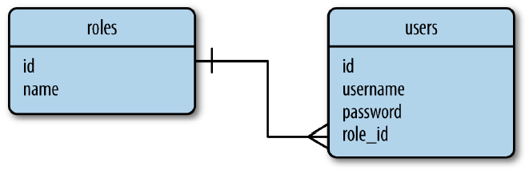

# 資料庫

可參考

[https://www.maxlist.xyz/2019/11/10/flask-sqlalchemy-setting/](https://www.maxlist.xyz/2019/11/10/flask-sqlalchemy-setting/)

# 初始化

```bash
pip install flask-sqlalchemy

```

在flask 是用SQLALCHEMY_DATABASE_URI 設置資料庫路徑

以sqlite為例

hello.py

```python
from flask import Flask, session, render_template, redirect, url_for
import os
from flask_sqlalchemy import SQLAlchemy

basedir = os.path.abspath(os.path.dirname(__file__)) #取得目前資料夾位置

app = Flask(__name__)
app.config['SECRET_KEY'] = 'hard to guess string'

bootstrap = Bootstrap(app)
moment = Moment(app)

# 設定資料庫URL 此處使用sqlite
app.config['SQLALCHEMY_DATABASE_URI'] =\
    'sqlite:///' + os.path.join(basedir, 'data.sqlite')
app.config['SQLALCHEMY_TRACK_MODIFICATIONS'] = False # 是否接收資料庫變動資訊
db = SQLAlchemy(app) #實體化db

```

[SQLite 視覺化工具](https://sqlitebrowser.org/dl/)

# 資料庫URL格式

sqlite沒有伺服器連結位置

host 伺服器

database 對應的db

[URL 格式](https://www.notion.so/057f0422399e4571beb3b40e5b5a56b6)

# 建立一對多model

建立role 與 user 兩個table (一對多(users))



__tablename__  是用來指定對應的table名稱

 db.Column( 欄位型態, 欄位選項 ) 用來指定欄位 

__repr__ 提供給人看的字串協助除錯與測試 (非必要)

relationship (欄位. 關係選項) 定義表與表的關係

[欄位型態](https://www.notion.so/ee1baf6b78a9495494abf2d5c1bb560e)

[欄位選項](https://www.notion.so/b60669b944b0464fad8e4c9d5c67ccec)

```python
class Role(db.Model):
    __tablename__ = 'roles' # 資料表名稱
    id = db.Column(db.Integer, primary_key=True) # 設定欄位
    name = db.Column(db.String(64), unique=True)
    users = db.relationship('User', backref='role') # 與user建立關係, 說明反向關聯

    def __repr__(self): # 提供字串
        return f'<Role self.name>' 

class User(db.Model):
    __tablename__ = 'users'
    id = db.Column(db.Integer, primary_key=True)
    username = db.Column(db.String(64), unique=True, index=True)
    role_id = db.Column(db.Integer, db.ForeignKey('roles.id')) # 指定外聯鍵是roles表的id

    def __repr__(self):
        return f'<User self.username>'
```

[關係選項](https://www.notion.so/1ccbacb6fbdf47f99e1bb4bee276a18b)

# 建立資料表

到cmd下指令 轉到flask shell建立資料庫

```bash
set FALSK_APP=hello.py
flask shell
>>> from hello import db
>>> db.create_all()
```

若出現 ImportError: DLL load failed while importing _sqlite3: 找不到指定的模組。
到[sqlite官網](https://www.sqlite.org/download.html)下載對應版本的dll 並放在DLLs資料夾中

如果資料表已經存在使用creat_all() 不會有反應

得先刪除現有的才能再create_all() 

刪除資料表

```bash
>>> db.drop_all()
```

若資料欄位變更，得先刪除再使用create_all，會使所有資料消失，因此[要用Migrate的方式更新]()

## 建立資料

用物件的方式建立各筆資料

```bash
>>> from hello import Role, User
>>> admin_role = Role(name="Admin")
>>> mod_role=Role(name='Moderator')
>>> user_role = Role(name='user')

>>> user_john = User(username='John',role=admin_role)
>>> user_susan = User(username='susan',role=user_role)
>>> user_david = User(username='david',role=user_role)
>>> print(admin_role.id)
None

```

此段結束物件都只在Python階段 還沒有送入資料庫因此拿不到id

與資料庫的溝通是使用Flask-SQLAlchemy的session 

commit() 會將被加到session的物件寫入資料庫

```bash
>>> db.session.add_all([admin_role,mod_role,user_role,user_john,user_susan,user_david])
>>> db.session.commit()
>>> print(admin_role.id)
1
```

將資料送入db後才拿的到id

## 修改資料

修改

```bash
>>> print(admin_role.name)
Admin
>>> admin_role.name='Adminstrator'
>>> db.session.add(admin_role)
>>> db.session.commit()
>>> print(admin_role.name)
Adminstrator
```

刪除

```bash
>>> db.session.delete(mod_role)
>>> db.session.commit()
```

# 查詢

query.all( ) 查詢出該資料表中的所有內容 以先前定義的__repr__ 的回傳形式呈現每筆資料的結果

```bash
>>> from hello import Role, User
>>> Role.query.all()
[<Role Adminstrator>, <Role user>]

>>> User.query.all()
[<User John>, <User susan>, <User david>]

User.query.filter_by(role=user_role).all() #最後的all() 是執行指令
```

如果退出flask shell 需要用資料重新建立物件才能用ORM形式操作

查看物件對應的原生SQL

```bash
>>> str(User.query.filter_by(role=user_role))
```

挑出roles表中name欄位 = User 的第一筆資料

```bash
 >>> from hello import Role, User
>>> user_role = Role.query.filter_by(name='User).first() #最後的first() 是執行指令
```

filter_by是查詢過濾器

[SQLAlchemy 過濾器指令](https://www.notion.so/52829a4bfa7d4dec85864a0560761938)

[SQLAlchemy執行指令](https://www.notion.so/6ac34fcf7a24449fb44b26434b54b9af)

## 關聯查詢

```bash
>>> users = user_role.users
>>> users
[<User u'susan'>, <User u'david'>]

>>> users[0].role
    <Role u'User'>
```

當user_role.users執行時會內部啟用all()的功能回傳符合資料的List, 因此無法再作更進一步的篩選

若要將使用者以名字排序的話, 要先關閉自動啟用all ()的功能

在Role class 設定關聯的地方做更改 補上 lazy='dynamic'

```python
class Role(db.Model)
.....
users = db.relationship('User',backref='role', lazy='dynamic')
.....
```

設定之後user_role.users 就會回傳一個尚未執行的查詢指令, 可再增加過濾器

```bash
>>> user_role.users.order_by(User.username).all()
    [<User u'david'>, <User u'susan'>]
    >>> user_role.users.count()
    2
```

# View函式中使用資料庫

修改hello.py的 index

當有名字送入時就會去檢查資料表中是否存在 並且更新session中的known

讓模板顯示不同訊息

hello.py

```python
@app.route('/', methods=['GET', 'POST']) 
def index():
	form = NameForm()
	if form.validate_on_submit():
			user = User.query.filter_by(username=form.name.data).first()
			if user is None:
		      user = User(username=form.name.data)
		      db.session.add(user)
		      session['known'] = False
			else:
					session['known'] = True
					session['name'] = form.name.data 
					form.name.data = ''
					return redirect(url_for('index'))
	return render_template('index.html', form=form, name=session.get('name'), known=session.get('known', False))
```

更新後的模板

templates/index.html

```python


Flasky

<div class="page-header">
	<h1>Hello, {{ name }}Stranger!</h1> 
	<p>Pleased to meet you!</p>
	
	<p>Happy to see you again!</p>
	
</div>
{{ wtf.quick_form(form) }}

```

# 整合Python Shell

每次啟動shell session時匯入資料庫實例和模型相當忙凡 因此設定flask shell 命令以便自動匯入資料庫實體與model 物件

建立 shell context processor (殼層環境處理常式)

透過app.shell_context_processor裝飾器註冊

hello.py

```bash
@app.shell_context_processor
def make_shell_context():
    return dict(db=db, User=User, Role=Role)
```

cmd 在啟用flask shell就會將上面的項目自動匯入

```bash
$ flask shell
>>> app
<Flask 'app'>
>>> db
<SQLAlchemy engine='sqlite:////home/flask/flasky/data.sqlite'>
>>> User
<class 'app.User'>
```

# Flask-Migrate 資料庫遷移

SQLAlchemy 的開發者寫的遷移框架 [Alembic](https://alembic.sqlalchemy.org/en/latest/)，[Flask-Migrate](https://flask-migrate.readthedocs.io/en/latest/)是將Alembic整合起來的包裝

[https://medium.com/seaniap/python-web-flask-實作-flask-migrate更新資料庫-a5ebc930422a](https://medium.com/seaniap/python-web-flask-%E5%AF%A6%E4%BD%9C-flask-migrate%E6%9B%B4%E6%96%B0%E8%B3%87%E6%96%99%E5%BA%AB-a5ebc930422a)

安裝

```bash
pip install flask-migrate
```

hello.py

```python
from flask_migrate import Migrate

app = Flask(__name__)
app.config['SECRET_KEY'] = 'hard to guess string'
*app.config['SQLALCHEMY_DATABASE_URI'] =\
    'sqlite:///' + os.path.join(basedir, 'data.sqlite')
app.config['SQLALCHEMY_TRACK_MODIFICATIONS'] = False*
db = SQLAlchemy(app)
migrate = Migrate(app, db) #初始化 migrate
```

在cmd 建立資料庫migrate的初始化

```bash
flask db init
```

Creating directory D:\flask_learning\app\migrations ...  done
Creating directory D:\flask_learning\app\migrations\versions ...  done
Generating D:\flask_learning\app\migrations\alembic.ini ...  done
Generating D:\flask_learning\app\migrations\env.py ...  done
Generating D:\flask_learning\app\migrations\README ...  done
Generating D:\flask_learning\app\migrations\script.py.mako ...  done
Please edit configuration/connection/logging settings in 'D:\\flask_learning\\app\\migrations\\alembic.ini' before proceeding.

此命令會建立migrations目錄，將所有的遷移腳本放在裡面

剛建立完的結構


設定migtations檔案 附加說明文字

```bash
flask db migrate -m "說明文字"
```

執行upgrade指令，將migrations檔案更新至資料庫中

```bash
flask db upgrade
```

## 建立遷移腳本

在flask shell 輸入db.create_all() 後的現有結構


當users資料表需要增加一個mobile欄位儲存user的電話。

需要在Users Model裡面增加一行欄位的敘述：

```python
class User(db.Model):
    __tablename__ = 'users'
    id = db.Column(db.Integer, primary_key=True)
    username = db.Column(db.String(64), unique=True, index=True)
    role_id = db.Column(db.Integer, db.ForeignKey('roles.id'))
    mobile= db.Column(db.String(10))
    def __repr__(self):
        return f'<User {self.username}>'
```

建立遷移腳本

在cmd中輸入

```bash
flask db migrate -m "增加mobile欄位"
```

INFO  [alembic.runtime.migration] Context impl SQLiteImpl.
INFO  [alembic.runtime.migration] Will assume non-transactional DDL.
INFO  [alembic.autogenerate.compare] Detected added column 'users.mobile'
Generating D:\flask_learning\app\migrations\versions\a49d85912532_增加age欄位.py ...  done

執行遷移 更新現有table

```bash
flask db upgrade
```

INFO  [alembic.runtime.migration] Context impl SQLiteImpl.
INFO  [alembic.runtime.migration] Will assume non-transactional DDL.
INFO  [alembic.runtime.migration] Running upgrade  -> a49d85912532, 增加mobile欄位

此項更新不會影響到現有資料內容

補充

只是想要單純生成 sql 語句，而不是生效到資料庫，通常是要遞交 sql 給 DBA 執行，可以：

```
flask db upgrade --sql
```

在專案中已經有了migrations資料夾，之後不需要再執行flask db init。

只要執行建立遷移腳本與執行兩個指令就可以更新table欄位。

完成migrate後的結構 新增加了mobile欄位


移除上一次的遷移變更

```bash
flask db downgrade
```

INFO  [alembic.runtime.migration] Context impl SQLiteImpl.
INFO  [alembic.runtime.migration] Will assume non-transactional DDL.
INFO  [alembic.runtime.migration] Running downgrade a49d85912532 -> , 增加mobile欄位