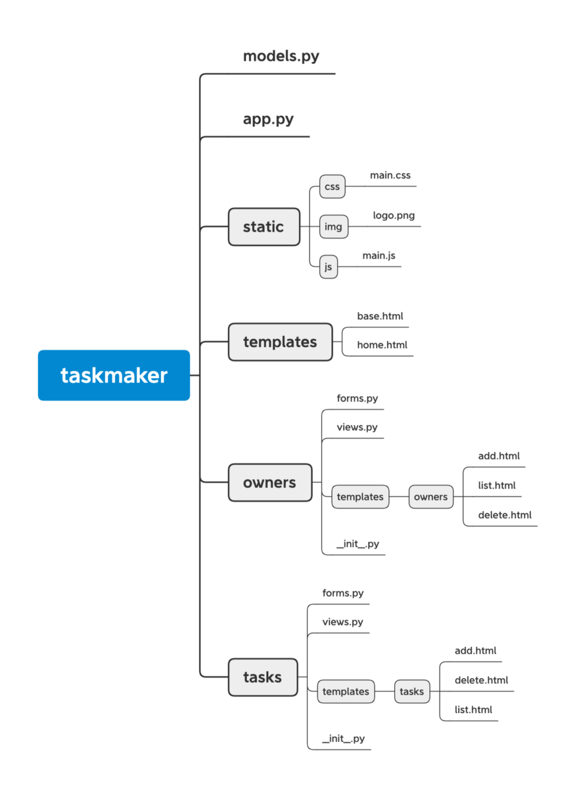

# 大型架構

## 類型一

模板統一放置在templates

```bash
|-flasky
    |-app/
        |-templates/   #畫面模板
        |-static/      # 圖片 JS CSS 等靜態檔案
				|-main/
						|-__init__.py
						|-errors.py
						|-forms.py
						|-views.py
				|-__init__.py
				|-email.py
				|-models.py
		|-migrations/  # 資料庫遷移檔案
		|-tests/     # 單元測試
				|-__init__.py
				|-test*.py
		|-venv/  # 虛擬環境檔案
		|-requirements.txt  # 套件依賴項目
		|-config.py  # 組態設定黨
		|-flasky.py  # 定義Flask app 實例 與協助管理app
```

## 類型二

依造功能區分資料夾 每個功能擁有自己的template, view, form

當app/templates 下沒有找到的 才會往個功能的資料夾中尋找

也可以指定模板位置

```python
from flask import Blueprint
owners_blueprints = Blueprint( 'owners', __name__, template_folder= 'templates/owners' )
```



