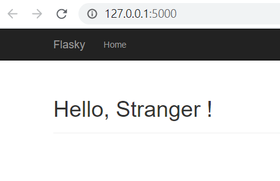

# 使用者個人資訊

製作使用者參與網站的摘要，並且提供使用者可以分享個人資訊網頁的URL

# 個人資訊

增加User table 欄位

```python
from werkzeug.security import generate_password_hash, check_password_hash
from flask_login import UserMixin, AnonymousUserMixin
from . import db, login_manager
from itsdangerous import TimedJSONWebSignatureSerializer as Serializer
from flask import current_app
from datetime import datetime

class User(UserMixin, db.Model):
    __tablename__ = 'users'
    id = db.Column(db.Integer, primary_key=True)
    username = db.Column(db.String(64), unique=True, index=True)
    email = db.Column(db.String(64), unique=True, index=True)  # 讓使用者可以用email 登入
    role_id = db.Column(db.Integer, db.ForeignKey('roles.id'))
    password_hash = db.Column(db.String(128))
    confirmed = db.Column(db.Boolean, default=False)  # 帳號確認狀態

		# 以下為本次新增欄位
    name = db.Column(db.String(64))  # 本名 
    location = db.Column(db.String(64)) 
    about_me = db.Column(db.Text())  
    member_since = db.Column(db.DateTime(), default=datetime.utcnow)  # 建立時間 default引數可以接受function 所以沒有()
    last_seen = db.Column(db.DateTime(), default=datetime.utcnow)  # 上次訪問時間

# ...
		# 新增function 讓每次使用者request都會更新
		def ping(self):
        self.last_seen = datetime.utcnow()
        db.session.add(self)

```

db.String和db.Text 差異在於db.Text是可變長度欄位，因此不需要指定最大長度

更新 before_request ( )

app/auth/views.py

```python
@auth.before_app_request  # 註冊成全域的裝飾器
def before_request():  
    if current_user.is_authenticated:  # 如果使用者有登入下的判斷
        current_user.ping()  # 每次都執行 更新上次登入時間
        if not current_user.confirmed and request.endpoint \
            and request.blueprint != 'auth' and request.endpoint != 'static':
            return redirect(url_for('auth.unconfirmed'))
```

# 使用者資訊網頁

## 設定個人資訊路由

app/main/views.py

```python
from flask import render_template
from . import main
from ..models import User

@main.route('/')
def index():
    return render_template('index.html')

@main.route('/user/<username>')
def user(username):
    user = User.query.filter_by(username=username).first_or_404()   # 若找不到user就跳404
    return render_template('user.html', user=user) # 將user傳入模板 顯示訊息
```

## 設定使用者模板

app/templates/user.html

```html


Flasky - {{ user.username }}


<div class="page-header">
    <h1>{{ user.username }}</h1>
    
    <p>
        
            {{ user.name }}
        
        
        <!--  會出現以user.location為中心的地圖      -->
            from <a href="http://maps.google.com/?q={{ user.location }}">{{ user.location }}</a>
        
    </p>
    
    
    <!-- 如果是管理者登入，就把使用者的email地址轉成mailto連結顯示   -->
    <p><a href="mailto:{{ user.email }}">{{ user.email }}</a></p>
    
    <p>{{ user.about_me }}</p>
    <!-- 顯示時間-->
    <p>Member since {{ moment(user.member_since).format('L') }}. Last seen {{ moment(user.last_seen).fromNow() }}.</p>
</div>

```

mailto 方便管理者在觀看另一位使用者的個人資訊網頁時，可以直接透過此連結聯絡那位user

## 更新首頁導覽列

app/templates/base.html

```html
 <!-- 繼承Bootstrap的基礎模版 -->

Flasky


{{ super() }}
<link rel="shortcut icon" href="{{ url_for('static', filename='favicon.ico') }}" type="image/x-icon">
<link rel="icon" href="{{ url_for('static', filename='favicon.ico') }}" type="image/x-icon">



<div class="navbar navbar-inverse" role="navigation">
    <div class="container">
        <div class="navbar-header">
            <button type="button" class="navbar-toggle" data-toggle="collapse" data-target=".navbar-collapse">
                <span class="sr-only">Toggle navigation</span>
                <span class="icon-bar"></span>
                <span class="icon-bar"></span>
                <span class="icon-bar"></span>
            </button>
            <a class="navbar-brand" href="{{ url_for('main.index') }}">Flasky</a>
        </div>
        <div class="navbar-collapse collapse">
            <ul class="nav navbar-nav">
                <li><a href="{{ url_for('main.index') }}">Home</a></li>
                
                <!--        登入下才能看到個人資訊頁        -->
                <li><a href="{{ url_for('main.user', username=current_user.username) }}">Profile</a></li>
                
            </ul>
            <ul class="nav navbar-nav navbar-right">
                
                <!--  登入狀況下提供下拉選單   -->
                <li class="dropdown">
                    <a href="#" class="dropdown-toggle" data-toggle="dropdown">Account<b class="caret"></b></a>
                    <ul class="dropdown-menu">
                        <li><a href="{{ url_for('auth.change_password') }}">Change Password</a></li>
                        <li><a href="{{ url_for('auth.change_email_request') }}">Change Email</a></li>
                        <li><a href="{{ url_for('auth.logout') }}">Log Out</a></li>
                    </ul>
                </li>
                
                <li><a href="{{ url_for('auth.login') }}">Log In</a></li>
                
            </ul>
        </div>
    </div>
</div>



<div class="container">
    
    <div class="alert alert-warning">
        <button type="button" class="close" data-dismiss="alert">&times;</button>
        {{ message }}
    </div>
    

    
</div>



{{ super() }}
{{ moment.include_moment() }}

```

登入前 



登入後的profile頁面 (還沒設定地址-沒有顯示地圖)


# 個人資訊編輯頁面


一般使用者要能夠在網頁上輸入自己的資訊顯示

管理者除了一般使用者輸入的資訊外，還有使用者角色的管理資訊可以改

## 使用者個人管理頁面

### 編輯表單

包含name, location, about_me 都是可選的欄位

app/main/forms.py

```python
from flask_wtf import FlaskForm
from wtforms import StringField, SubmitField, TextAreaField
from wtforms.validators import DataRequired, Length

class EditProfileForm(FlaskForm):
    name = StringField('Real name', validators=[Length(0, 64)])
    location = StringField('Location', validators=[Length(0, 64)])
    about_me = TextAreaField('About me')
    submit = SubmitField('Submit')
```

### 個人資訊編輯路由

app/main/views.py

```python
from flask import render_template, redirect, url_for, abort, flash
from flask_login import login_required, current_user
from . import main
from .. import db
from ..models import Role, User
from .forms import EditProfileForm

@main.route('/')
def index():
    return render_template('index.html')

@main.route('/user/<username>')
def user(username):
    user = User.query.filter_by(username=username).first_or_404()  # 若找不到user就跳404
    return render_template('user.html', user=user)  # 將user傳入模板 顯示訊息

@main.route('/edit-profile', methods=['GET', 'POST'])
@login_required
def edit_profile(): # 使用者編輯路由
    form = EditProfileForm()
    if form.validate_on_submit():
        current_user.name = form.name.data # 用form.<field.name>.data 取得資料
        current_user.location = form.location.data
        current_user.about_me = form.about_me.data
        db.session.add(current_user._get_current_object())
        db.session.commit()
        flash('Your profile has been updated.')
        return redirect(url_for('.user', username=current_user.username))
    form.name.data = current_user.name
    form.location.data = current_user.location
    form.about_me.data = current_user.about_me
    return render_template('edit_profile.html', form=form)
```

用form.<field.name>.data 取得資料，可以取得用戶送出的值外，也能在使用者編輯時顯示預設值，在尚未送出表單時，三個欄位會被設定為在current_user對應欄位的值，一旦表單送出後才會被更新

### 編輯模板

app/templates/edit_profile.html

```html



Flasky - Edit Profile


<div class="page-header">
    <h1>Edit Your Profile</h1>
</div>
<div class="col-md-4">
    {{ wtf.quick_form(form) }}
</div>

```

### 一般使用者個人資訊連結

在個人資訊的網頁加入連結

app/templates/user.html

```html


Flasky - {{ user.username }}


<div class="page-header">
    <h1>{{ user.username }}</h1>
    
    <p>
        
            {{ user.name }}
        
        
        <!--  會出現以user.location為中心的地圖      -->
            from <a href="http://maps.google.com/?q={{ user.location }}">{{ user.location }}</a>
        
    </p>
    
    
    <!-- 如果是管理員登入，就把使用者的email地址轉成mailto連結顯示   -->
    <p><a href="mailto:{{ user.email }}">{{ user.email }}</a></p>
    
    <p>{{ user.about_me }}</p>
    <!-- 顯示時間-->
    <p>Member since {{ moment(user.member_since).format('L') }}. Last seen {{ moment(user.last_seen).fromNow() }}.</p>

    <p>
    <!--    當使用者登入時 只會顯示自己的連結    -->
        
        <a class="btn btn-default" href="{{ url_for('.edit_profile') }}">Edit Profile</a>
        
    </p>
</div>

```

輸入[http://127.0.0.1:5000/edit-profile](http://127.0.0.1:5000/edit-profile) 進入編輯頁，如果第一次填寫欄位會是空白的，第二次填寫時會保留上次的資料，送出後轉跳到user 基本訊息頁，點選連結會跳到google map


## 管理員的個人資訊編輯頁面

管理員的個人資訊編輯頁，除了原本的三個資料欄位外，也可以在這個表單編輯使用者的email , 名稱, 確認狀態 和角色資訊

app/main/forms.py

```python
from flask_wtf import FlaskForm
from wtforms import StringField, TextAreaField, BooleanField, SelectField,\
    SubmitField
from wtforms.validators import DataRequired, Length, Email, Regexp
from wtforms import ValidationError
from ..models import Role, User

class NameForm(FlaskForm):
    name = StringField('What is your name?', validators=[DataRequired()])
    submit = SubmitField('Submit')

class EditProfileForm(FlaskForm):  # 一班使用者 使用表單
    name = StringField('Real name', validators=[Length(0, 64)])
    location = StringField('Location', validators=[Length(0, 64)])
    about_me = TextAreaField('About me')
    submit = SubmitField('Submit')

class EditProfileAdminForm(FlaskForm):  # 管理員使用表單
    email = StringField('Email', validators=[DataRequired(), Length(1, 64),
                                             Email()])
    username = StringField('Username', validators=[
        DataRequired(), Length(1, 64),
        Regexp('^[A-Za-z][A-Za-z0-9_.]*$', 0,
               'Usernames must have only letters, numbers, dots or '
               'underscores')])
    confirmed = BooleanField('Confirmed')
    role = SelectField('Role', coerce=int) # 定義下拉式選單欄位, coerce 指定key為整數
    name = StringField('Real name', validators=[Length(0, 64)])
    location = StringField('Location', validators=[Length(0, 64)])
    about_me = TextAreaField('About me')
    submit = SubmitField('Submit')

    def __init__(self, user, *args, **kwargs):
        super(EditProfileAdminForm, self).__init__(*args, **kwargs)
				# 提供下拉選單實體 可選擇的值
        self.role.choices = [(role.id, role.name) 
                             for role in Role.query.order_by(Role.name).all()] # 將角色依造字母順序排序
        self.user = user

    def validate_email(self, field):
        if field.data != self.user.email and \
                User.query.filter_by(email=field.data).first():
            raise ValidationError('Email already registered.')

    def validate_username(self, field):
        if field.data != self.user.username and \
                User.query.filter_by(username=field.data).first():
            raise ValidationError('Username already in use.')
```

SelectField 是WTForm包裝HTML <select> 下拉選單的函式，[之前的範例](https://www.notion.so/Web-268d26c367b94d889c7b7067de63fce2)，是在建立欄位時就先給予下拉選單的選項

此處是當role 選單實體化之後，在用choices的屬性設定對應的值

choices 可以用tuple的形式( key, value)，也可以用list 其中只有value。 [官網說明](https://wtforms.readthedocs.io/en/2.3.x/fields/#wtforms.fields.SelectField)

當表單送出時預設是字串，因此要多加一個coerce=int的引述，讓欄位值為整數

email 和 username 欄位的validate_function，會檢查欄位值有沒有被更改，若有再檢查是否與現有的其他用戶相同 

### 管理員的資訊編輯路由

app/main/views.py

```python
from flask import render_template, redirect, url_for, abort, flash
from flask_login import login_required, current_user
from . import main
from .forms import EditProfileForm, EditProfileAdminForm
from .. import db
from ..models import Role, User
from ..decorators import admin_required

@main.route('/')
def index():
    return render_template('index.html')

@main.route('/user/<username>')
def user(username):
    user = User.query.filter_by(username=username).first_or_404()
    return render_template('user.html', user=user)

@main.route('/edit-profile', methods=['GET', 'POST'])
@login_required
def edit_profile():
    form = EditProfileForm()
    if form.validate_on_submit():
        current_user.name = form.name.data
        current_user.location = form.location.data
        current_user.about_me = form.about_me.data
        db.session.add(current_user._get_current_object())
        db.session.commit()
        flash('Your profile has been updated.')
        return redirect(url_for('.user', username=current_user.username))
    form.name.data = current_user.name
    form.location.data = current_user.location
    form.about_me.data = current_user.about_me
    return render_template('edit_profile.html', form=form)

@main.route('/edit-profile/<int:id>', methods=['GET', 'POST'])
@login_required
@admin_required
def edit_profile_admin(id):
    user = User.query.get_or_404(id)
    form = EditProfileAdminForm(user=user)
    if form.validate_on_submit():
        user.email = form.email.data
        user.username = form.username.data
        user.confirmed = form.confirmed.data
        user.role = Role.query.get(form.role.data) # 上面表單的下拉選單處取得data
        user.name = form.name.data
        user.location = form.location.data
        user.about_me = form.about_me.data
        db.session.add(user)
        db.session.commit()
        flash('The profile has been updated.')
        return redirect(url_for('.user', username=user.username))
    form.email.data = user.email
    form.username.data = user.username
    form.confirmed.data = user.confirmed
    form.role.data = user.role_id
    form.name.data = user.name
    form.location.data = user.location
    form.about_me.data = user.about_me
    return render_template('edit_profile.html', form=form, user=user)
```

之前實做的[admin_required裝飾器](https://www.notion.so/051e09950843492482c3e9b274996a49)，當非管理者的使用者使用此路由時會收到403

此處的user.role 與 form.role.data，是在表單處特別處裡的SelectField，一開始會先將role_id指派給field.role.data。當表單被送出後會從欄位的data屬性中取得id，透過此id拿到role物件。在表單處宣告SelectField時給予的coerce=int引數，是為了確保這邊拿到的data屬性會被轉換成整數

### 管理員個人資訊編輯連結

app/templates/user.html

```html


Flasky - {{ user.username }}


<div class="page-header">
    <h1>{{ user.username }}</h1>
    
    <p>
        
            {{ user.name }}
        
        
        <!--  會出現以user.location為中心的地圖      -->
            from <a href="http://maps.google.com/?q={{ user.location }}">{{ user.location }}</a>
        
    </p>
    
    
    <!-- 如果是管理員登入，就把使用者的email地址轉成mailto連結顯示   -->
    <p><a href="mailto:{{ user.email }}">{{ user.email }}</a></p>
    
    <p>{{ user.about_me }}</p>
    <!-- 顯示時間-->
    <p>Member since {{ moment(user.member_since).format('L') }}. Last seen {{ moment(user.last_seen).fromNow() }}.</p>

    <p>
    <!--    當使用者登入時 只會顯示自己的連結    -->
        
        <a class="btn btn-default" href="{{ url_for('.edit_profile') }}">Edit Profile</a>
        
    <!--    管理員編輯連結    -->
        
        <a class="btn btn-danger" href="{{ url_for('.edit_profile_admin', id=user.id) }}">Edit Profile [Admin]</a>
        
    </p>
</div>

```

管理員編輯連結使用不同顏色的按鈕

(從資料庫中將angus 設為 管理員 role_id = 3)


# 使用者頭像(avatar)

使用[Gravatar](https://en.gravatar.com/)的服務取得使用者的個人頭像。Gravatar會建立頭像與email的關聯，當使用者在該網站上建立帳號後，上傳自己的圖像，Gravatar會提供一個特殊的URL包含email的hd5加密，用來辨識個別用戶的圖像。若沒有建立帳號會得到預設的圖像，另外也可以在URL最後加上 ? 用不同引數來設置圖像的設定。

使用Python 將example信箱加密

```bash
python
>>> import hashlib
>>> hashlib.md5("john@example.com".encode('utf-8')).hexdigest()
'd4c74594d841139328695756648b6bd6'
```

[https://secure.gravatar.com/avatar/d4c74594d841139328695756648b6bd6](https://secure.gravatar.com/avatar/d4c74594d841139328695756648b6bd6)

預設圖


[Gravatar 設定參數](https://www.notion.so/65256b44ff924ceebf3c885a95a38329)

[https://secure.gravatar.com/avatar/d4c74594d841139328695756648b6bd6?d=identicon](https://secure.gravatar.com/avatar/d4c74594d841139328695756648b6bd6?d=identicon)

幾何圖形


### 在User model產生頭像

添加產生URL 連結的function，Gravatar 要求md5加密的信箱只能有小寫字母

app/models.py

```python
# ...
import hashlib
# ...

class User(UserMixin, db.Model):
# ...
def gravatar(self, size=100, default='identicon', rating='g'):
        url = 'https://secure.gravatar.com/avatar'
        hash = hashlib.md5(self.email.lower().encode('utf-8')).hexdigest() # 加密後轉小寫再encode
        return f'{url}/{hash}?s={size}&d={default}&r={rating}'
```

hashlib 加密啊的字串型別為二進位制編碼 所以要用encode進行轉換，再用後面的方法取得字串

**hash.digest() 返回摘要，作為二進位制資料字串值**

**hash.hexdigest() 返回摘要，作為十六進位制資料字串值,**

[參考](https://codertw.com/%E7%A8%8B%E5%BC%8F%E8%AA%9E%E8%A8%80/615922/)

測試function

```python
>>> u = User(email='john@example.com')
>>> u.gravatar()
'https://secure.gravatar.com/avatar/d4c74594d841139328695756648b6bd6?s=100&d=identicon&r=g'
>>> u.gravatar(size=256)
'https://secure.gravatar.com/avatar/d4c74594d841139328695756648b6bd6?s=256&d=identicon&r=g'
```

第一個預設的


第二個 設置256pixel


## 將頭像加入個人資訊頁

app/templates/user.html

```html


Flasky - {{ user.username }}


<div class="page-header">
<!--    增加圖片連結 與 CSS用的class 名稱 profile-thumbnail 和 profile-header-->
    
    <div class="profile-header">
        <h1>{{ user.username }}</h1>
        
        <p>
            
                {{ user.name }}
            
            
            <!--  會出現以user.location為中心的地圖      -->
                from <a href="http://maps.google.com/?q={{ user.location }}">{{ user.location }}</a>
            
        </p>
        
        
        <!-- 如果是管理員登入，就把使用者的email地址轉成mailto連結顯示   -->
        <p><a href="mailto:{{ user.email }}">{{ user.email }}</a></p>
        
        <p>{{ user.about_me }}</p>
        <!-- 顯示時間-->
        <p>Member since {{ moment(user.member_since).format('L') }}. Last seen {{ moment(user.last_seen).fromNow() }}.</p>

        <p>
        <!--    當使用者登入時 只會顯示自己的連結    -->
            
            <a class="btn btn-default" href="{{ url_for('.edit_profile') }}">Edit Profile</a>
            
        <!--    管理員編輯連結    -->
            
            <a class="btn btn-danger" href="{{ url_for('.edit_profile_admin', id=user.id) }}">Edit Profile [Admin]</a>
            
        </p>
    </div>
</div>

```

再沒有修改CSS 的情況下


### 修改呈現樣式

設置靜態CSS 檔案

app/static/styles.css

```css
.profile-thumbnail {
    position: absolute;
}
.profile-header {
    min-height: 260px;
    margin-left: 280px;
}
```

修改base template 讓導覽列也能出現圖片

app/templates/base.html

```html
 <!-- 繼承Bootstrap的基礎模版 -->

Flasky


{{ super() }}
<link rel="shortcut icon" href="{{ url_for('static', filename='favicon.ico') }}" type="image/x-icon">
<link rel="icon" href="{{ url_for('static', filename='favicon.ico') }}" type="image/x-icon">
<link rel="stylesheet" type="text/css" href="{{ url_for('static', filename='styles.css') }}">



<div class="navbar navbar-inverse" role="navigation">
    <div class="container">
        <div class="navbar-header">
            <button type="button" class="navbar-toggle" data-toggle="collapse" data-target=".navbar-collapse">
                <span class="sr-only">Toggle navigation</span>
                <span class="icon-bar"></span>
                <span class="icon-bar"></span>
                <span class="icon-bar"></span>
            </button>
            <a class="navbar-brand" href="{{ url_for('main.index') }}">Flasky</a>
        </div>
        <div class="navbar-collapse collapse">
            <ul class="nav navbar-nav">
                <li><a href="{{ url_for('main.index') }}">Home</a></li>
                
                <!--        登入下才能看到個人資訊頁        -->
                <li><a href="{{ url_for('main.user', username=current_user.username) }}">Profile</a></li>
                
            </ul>
            <ul class="nav navbar-nav navbar-right">
                
                <!--  登入狀況下提供下拉選單   -->
                <li class="dropdown">
                        <!--   增加avatar 圖像       -->
                     <a href="#" class="dropdown-toggle" data-toggle="dropdown">
                        
                        Account <b class="caret"></b>
                    </a>
                    <ul class="dropdown-menu">
                        <li><a href="{{ url_for('auth.change_password') }}">Change Password</a></li>
                        <li><a href="{{ url_for('auth.change_email_request') }}">Change Email</a></li>
                        <li><a href="{{ url_for('auth.logout') }}">Log Out</a></li>
                    </ul>
                </li>
                
                <li><a href="{{ url_for('auth.login') }}">Log In</a></li>
                
            </ul>
        </div>
    </div>
</div>



<div class="container">
    
    <div class="alert alert-warning">
        <button type="button" class="close" data-dismiss="alert">&times;</button>
        {{ message }}
    </div>
    

    
</div>



{{ super() }}
{{ moment.include_moment() }}

```


## 儲存MD5雜湊值

產生頭像時的MD5是耗費CPU的操作，若需要產生大量的頭像負擔會非常重。另外只要email不變，MD5出來的值也會相同，所以在User model中透過欄位儲存MD5的雜湊值降低負擔。

app/models.py (目前完整的model)

```python
from werkzeug.security import generate_password_hash, check_password_hash
from flask_login import UserMixin, AnonymousUserMixin
from . import db, login_manager
from itsdangerous import TimedJSONWebSignatureSerializer as Serializer
from flask import current_app, request
from datetime import datetime
import hashlib

class Permission:  # 負責權限值
    FOLLOW = 1
    COMMENT = 2
    WRITE = 4
    MODERATE = 8
    ADMIN = 16

class Role(db.Model):
    __tablename__ = 'roles'
    id = db.Column(db.Integer, primary_key=True)
    name = db.Column(db.String(64), unique=True)
    default = db.Column(db.Boolean, default=False, index=True)
    permissions = db.Column(db.Integer)
    users = db.relationship('User', backref='role', lazy='dynamic')

    def __init__(self, **kwargs):
        super(Role, self).__init__(**kwargs)
        if self.permissions is None:
            self.permissions = 0

    @staticmethod
    def insert_roles():
        roles = {
            'User': [Permission.FOLLOW, Permission.COMMENT, Permission.WRITE],
            'Moderator': [Permission.FOLLOW, Permission.COMMENT,
                          Permission.WRITE, Permission.MODERATE],
            'Administrator': [Permission.FOLLOW, Permission.COMMENT,
                              Permission.WRITE, Permission.MODERATE,
                              Permission.ADMIN],
        }
        default_role = 'User'
        for r in roles:
            role = Role.query.filter_by(name=r).first()
            if role is None:
                role = Role(name=r)
            role.reset_permissions()
            for perm in roles[r]:
                role.add_permission(perm)
            role.default = (role.name == default_role)
            db.session.add(role)
        db.session.commit()

    def add_permission(self, perm):
        if not self.has_permission(perm):
            self.permissions += perm

    def remove_permission(self, perm):
        if self.has_permission(perm):
            self.permissions -= perm

    def reset_permissions(self):
        self.permissions = 0

    def has_permission(self, perm):
        return self.permissions & perm == perm

    def ping(self):
        self.last_seen = datetime.utcnow()
        db.session.add(self)

    def __repr__(self):
        return '<Role %r>' % self.name

class User(UserMixin, db.Model):
    __tablename__ = 'users'
    id = db.Column(db.Integer, primary_key=True)
    username = db.Column(db.String(64), unique=True, index=True)
    email = db.Column(db.String(64), unique=True, index=True)  # 讓使用者可以用email 登入
    role_id = db.Column(db.Integer, db.ForeignKey('roles.id'))
    password_hash = db.Column(db.String(128))
    confirmed = db.Column(db.Boolean, default=False)  # 帳號確認狀態
    name = db.Column(db.String(64))  # 本名
    location = db.Column(db.String(64))
    about_me = db.Column(db.Text())
    member_since = db.Column(db.DateTime(), default=datetime.utcnow)  # 建立時間
    last_seen = db.Column(db.DateTime(), default=datetime.utcnow)  # 上次訪問時間
    avatar_hash = db.Column(db.String(32))  # 儲存頭像URL用

    def __init__(self, **kwargs):  # 新增建構式
        super(User, self).__init__(**kwargs)
        if self.role is None:
            if self.email == current_app.config['FLASKY_ADMIN']:
                self.role = Role.query.filter_by(name='Administrator').first()
            if self.role is None:
                self.role = Role.query.filter_by(default=True).first()
        # 判斷有email卻沒有圖像連結時才創建
        if self.email is not None and self.avatar_hash is None:
            self.avatar_hash = self.gravatar_hash()

    @property  # property 是只能讀取的屬性特性
    def password(self):
        raise AttributeError('password is not a readable attribute')

    @password.setter  # 因為已經用property限定password唯讀, 要另外用setter才能修改
    def password(self, password):
        self.password_hash = generate_password_hash(password)

    def verify_password(self, password):  # 驗證輸入的密碼與user model中hash的字串
        return check_password_hash(self.password_hash, password)

    def generate_confirmation_token(self, expiration=3600):  # 預設產生一小時期限包含id內容的token
        s = Serializer(current_app.config['SECRET_KEY'], expiration)
        return s.dumps({'confirm': self.id}).decode('utf-8')  # 使用utf-8編碼

    def confirm(self, token):
        s = Serializer(current_app.config['SECRET_KEY'])
        try:
            data = s.loads(token.encode('utf-8'))
        except:
            return False

        if data.get('confirm') != self.id:
            return False
        self.confirmed = True
        db.session.add(self)
        return True

    def generate_reset_token(self, expiration=3600):
        s = Serializer(current_app.config['SECRET_KEY'], expiration)
        return s.dumps({'reset': self.id}).decode('utf-8')

    @staticmethod
    def reset_password(token, new_password):  # 重設密碼功能
        s = Serializer(current_app.config['SECRET_KEY'])
        try:
            data = s.loads(token.encode('utf-8'))
        except:
            return False

        user = User.query.get(data.get('reset'))
        if user is None:
            return False
        user.password = new_password
        db.session.add(user)
        return True

    def generate_email_change_token(self, new_email, expiration=3600):
        s = Serializer(current_app.config['SECRET_KEY'], expiration)
        return s.dumps(
            {'change_email': self.id, 'new_email': new_email}).decode('utf-8')

    def change_email(self, token):
        s = Serializer(current_app.config['SECRET_KEY'])
        try:
            data = s.loads(token.encode('utf-8'))
        except:
            return False
        if data.get('change_email') != self.id:
            return False
        new_email = data.get('new_email')
        if new_email is None:
            return False
        if self.query.filter_by(email=new_email).first() is not None:
            return False
        self.email = new_email
        self.avatar_hash = self.gravatar_hash()  # email變更時 圖像URL也要更新
        db.session.add(self)
        return True

    # 檢查權限用
    def can(self, perm):
        return self.role is not None and self.role.has_permission(perm)

    def is_administrator(self):
        return self.can(Permission.ADMIN)

    def ping(self):
        self.last_seen = datetime.utcnow()
        db.session.add(self)

    def gravatar_hash(self):  # 產生email MD5 hash值
        return hashlib.md5(self.email.lower().encode('utf-8')).hexdigest()

    def gravatar(self, size=100, default='identicon', rating='g'): # 產生gravatar的URL
        url = 'https://secure.gravatar.com/avatar'
        hash = self.avatar_hash or self.gravatar_hash()
        return f'{url}/{hash}?s={size}&d={default}&r={rating}'

    def __repr__(self):
        return f'<User> {self.username}'

class AnonymousUser(AnonymousUserMixin):
    def can(self, permissions):
        return False

    def is_administrator(self):
        return False

login_manager.anonymous_user = AnonymousUser

@login_manager.user_loader  # 向flask-login 註冊此函式
def load_user(user_id):
    return User.query.get(int(user_id))

```

更新db table

```python
flask db migrate -m "add User table avatar_hash column"
flask db upgrade
```